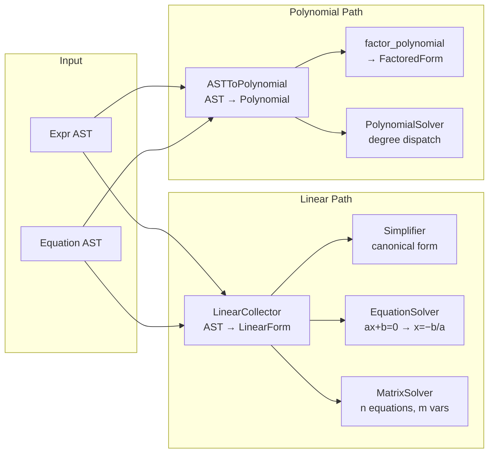
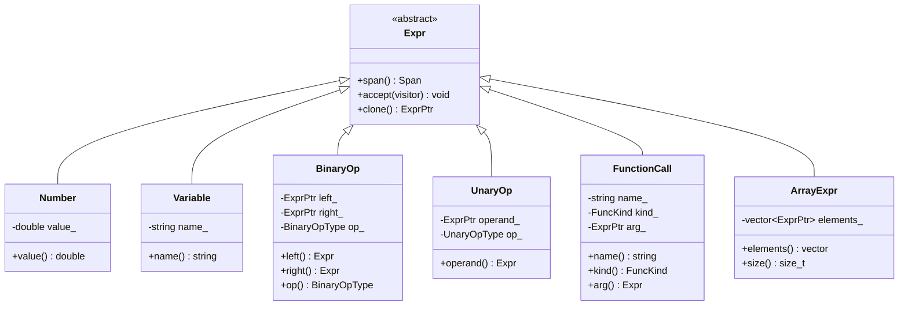

# Algebra Layer

> **Audience:** Developers who need to understand the symbolic math algorithms — linear collection, polynomial representation, factoring, equation solving, and matrix systems.

## Full Algebra Pipeline

The algebra layer has **two parallel paths** for processing math expressions:

| Path           | Entry Point       | Representation                            | Consumers                                      |
| -------------- | ----------------- | ----------------------------------------- | ---------------------------------------------- |
| **Linear**     | `LinearCollector` | `LinearForm` (coefficient map + constant) | `Simplifier`, `EquationSolver`, `MatrixSolver` |
| **Polynomial** | `ASTToPolynomial` | `Polynomial` (monomial→coefficient map)   | `factor_polynomial`, `PolynomialSolver`        |

Both paths accept raw `Expr` AST nodes (or `Equation` nodes for equations) and lower them to algebraic intermediate representations. The linear path is fast but rejects anything non-linear; the polynomial path handles arbitrary-degree expressions but rejects transcendental functions and variable denominators.

---

## Sub-Pages

### Data Structures & Conversion

| Document                                | Description                                                                        | Source                                    |
| --------------------------------------- | ---------------------------------------------------------------------------------- | ----------------------------------------- |
| [Linear Collector](linear-collector.md) | `LinearForm` struct and `LinearCollector` visitor — extracts affine forms from AST | `src/algebra/linear/linear_collector.hpp` |
| [Polynomial](polynomial.md)             | `Monomial` and `Polynomial` types — graded lexicographic ordering, arithmetic, GCD | `src/algebra/polynomial/polynomial.hpp`   |
| [AST → Polynomial](ast-to-poly.md)      | `ASTToPolynomial` visitor — lowers AST to polynomial representation                | `src/algebra/polynomial/ast_to_poly.hpp`  |

### Operations

| Document                | Description                                                           | Source                              |
| ----------------------- | --------------------------------------------------------------------- | ----------------------------------- |
| [Simplify](simplify.md) | `Simplifier` — canonicalizes equations to $Ax + By + \ldots = C$ form | `src/algebra/linear/simplify.hpp`   |
| [Factor](factor.md)     | `factor_polynomial` — extracts GCDs and factors quadratics            | `src/algebra/polynomial/factor.hpp` |

### Solvers

| Document                            | Description                                                             | Source                                       |
| ----------------------------------- | ----------------------------------------------------------------------- | -------------------------------------------- |
| [Linear Solver](solver.md)          | `EquationSolver` — solves single-variable $ax + b = 0$                  | `src/algebra/solver/solver.{hpp,cpp}`        |
| [Polynomial Solver](poly-solver.md) | `PolynomialSolver` — quadratic formula and Durand–Kerner for degree ≥ 3 | `src/algebra/solver/poly_solver.hpp`         |
| [Matrix Solver](matrix-solver.md)   | `MatrixSolver` — Gaussian elimination and LU for $n$-equation systems   | `src/algebra/matrix/matrix_solver.{hpp,cpp}` |

### Configuration

| Document                  | Description                                                | Source                   |
| ------------------------- | ---------------------------------------------------------- | ------------------------ |
| [Tolerance](tolerance.md) | `kEpsilon`, `kCoeffTol`, `kPivotTol` — precision constants | `src/core/tolerance.hpp` |

---

## AST Nodes Consumed by Algebra

The algebra layer processes `Expr` subtypes via the visitor pattern. Each concrete `Expr` node is dispatched in `LinearCollector` and `ASTToPolynomial`:

| Node            | Linear Collector                               | AST → Polynomial           |
| --------------- | ---------------------------------------------- | -------------------------- |
| `Number`        | `LinearForm(value)`                            | `Polynomial(value)`        |
| `Variable`      | `LinearForm(name, 1.0)` or context substitute  | `Polynomial(1.0, name, 1)` |
| `BinaryOp(Add)` | `L + R`                                        | `L + R`                    |
| `BinaryOp(Sub)` | `L − R`                                        | `L − R`                    |
| `BinaryOp(Mul)` | One side must be constant                      | `L × R` (any degree)       |
| `BinaryOp(Div)` | Divisor must be constant                       | Divisor must be constant   |
| `BinaryOp(Pow)` | Only `x^0`, `x^1`, or const base               | Integer exponent ≥ 0 only  |
| `UnaryOp(Neg)`  | Negate                                         | `−1 × operand`             |
| `FunctionCall`  | Constant arg → evaluate; variable arg → reject | Always reject              |
| `ArrayExpr`     | Always reject                                  | Always reject              |

The `Equation` node (not an `Expr` subclass) wraps two `ExprPtr` children (`lhs`, `rhs`) and is consumed directly by `EquationSolver` and `Simplifier`.

---

## Error Codes

All solver-specific errors are defined in `src/diagnostics/kinds/solver_errors.hpp`:

| Code  | Factory Function              | Meaning                                            |
| ----- | ----------------------------- | -------------------------------------------------- |
| E0301 | `no_solution()`               | Single equation has no solution                    |
| E0302 | `infinite_solutions()`        | Single equation has infinite solutions (tautology) |
| E0303 | `invalid_equation()`          | Malformed or invalid equation structure            |
| E0304 | `multiple_unknowns()`         | More than one unknown after substitution           |
| E0310 | `system_no_solution()`        | System of equations is inconsistent                |
| E0311 | `system_infinite_solutions()` | System is underdetermined (hint: `--free-vars`)    |
| E0315 | `unsupported_equation()`      | Non-linear or transcendental equation              |

---

## Further Reading

- [AST](../ast.md) — Expression node types and visitor interface
- [Evaluation](../evaluation.md) — How the evaluator calls into the resolver
- [Error Codes](../../reference/error-codes.md) — Complete error code table
- [Architecture Overview](../overview.md) — Full pipeline context
