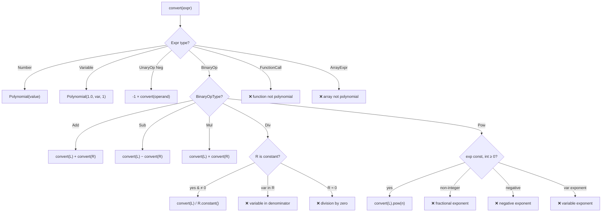

# AST → Polynomial Conversion

> **Source:** `src/algebra/polynomial/ast_to_poly.hpp`
>
> Lowers an `Expr` AST into a `Polynomial` representation. This is a **strict lowering** — not all expressions can be converted.

---

## Overview

`ASTToPolynomial` is a visitor that walks an `Expr` AST and produces a `Polynomial`. Unlike `LinearCollector` (which only accepts linear expressions), it handles arbitrary-degree polynomials — but rejects transcendental functions, variable denominators, and non-integer exponents.

**Key difference from `LinearCollector`:**

| Feature              | `LinearCollector`                         | `ASTToPolynomial`                         |
| -------------------- | ----------------------------------------- | ----------------------------------------- |
| Output type          | `LinearForm` (coefficient map + constant) | `Polynomial` (monomial → coefficient map) |
| Degree limit         | Degree 1 only                             | Arbitrary degree                          |
| `x * y`              | ❌ Rejected                                | ✓ Produces $xy$                           |
| `x ^ 3`              | ❌ Rejected                                | ✓ Produces $x^3$                          |
| Context substitution | ✓ Yes                                     | ❌ No                                      |
| Function calls       | Constant args → evaluate                  | ❌ Always rejected                         |

---

## Class: `ASTToPolynomial`

### Internal State

| Field     | Type                        | Purpose                              |
| --------- | --------------------------- | ------------------------------------ |
| `result_` | `Polynomial`                | Accumulated polynomial result        |
| `error_`  | `std::optional<Diagnostic>` | First error encountered              |
| `input_`  | `std::string`               | Raw source text for diagnostic spans |

### Entry Point: `convert(expr)`

```cpp
Result<Polynomial> convert(const Expr& expr);
```

1. **Resets** `error_` and `result_` (allows reuse)
2. Calls `expr.accept(*this)`
3. Returns `Result::err(error_)` if set, else `Result::ok(result_)`

---

## AST Node Dispatch



---

## Visitor Methods — Detailed

### `visit(Number)`

Stores as a constant polynomial:
```
result_ = Polynomial(node.value())
```
Always succeeds.

### `visit(Variable)`

Stores as a degree-1 monomial with coefficient 1:
```
result_ = Polynomial(1.0, node.name(), 1)
```
**Note:** No context substitution — variables are always treated as unknowns.

### `visit(UnaryOp)`

Only handles `UnaryOpType::Neg`:
1. Early return if `error_` is set
2. Recursively visit operand
3. `result_ = result_ * -1.0` (negate via scalar multiply)

### `visit(BinaryOp)`

Recursively visits both operands, then combines:

| Operator | Action                          | Rejection                                                             |
| -------- | ------------------------------- | --------------------------------------------------------------------- |
| **Add**  | `left + right`                  | None                                                                  |
| **Sub**  | `left - right`                  | None                                                                  |
| **Mul**  | `left * right`                  | None — any degree combination is valid                                |
| **Div**  | `left / right.constant_value()` | (1) `right` must be constant; (2) `right.constant_value()` ≥ kEpsilon |
| **Pow**  | `left.pow(int_exp)`             | (1) exponent must be constant; (2) must be non-negative integer       |

#### Division Rules

1. Recursively convert both operands
2. Check if `right.is_constant()`:
   - **No** → Error: "variable in denominator — cannot form polynomial"
   - **Yes, value ≈ 0** → Error: "division by zero"
   - **Yes, value ≠ 0** → `result_ = left / right.constant_value()`

#### Exponentiation Rules

1. Recursively convert both operands
2. Check if `right.is_constant()`:
   - **No** → Error: "variable in exponent"
3. Get `exp_val = right.constant_value()`
4. Check if integer: `|exp_val − round(exp_val)| < kEpsilon`
   - **No** → Error: "fractional exponent"
5. Check if ≥ 0:
   - **No** → Error: "negative exponent — cannot form polynomial"
6. `result_ = left.pow(int(round(exp_val)))`

### `visit(FunctionCall)`

Unconditionally rejected:
```
Error: "function call 'sin' cannot appear in polynomial expression"
```

Even for constant-argument calls like `sin(2)` — unlike `LinearCollector` which evaluates those.

### `visit(ArrayExpr)`

Unconditionally rejected:
```
Error: "array value cannot appear in polynomial expression"
```

---

## Conversion Rules Summary

| AST Node            | Polynomial         | Constraint                                       |
| ------------------- | ------------------ | ------------------------------------------------ |
| `Number(v)`         | $v$ (constant)     | Always succeeds                                  |
| `Variable(x)`       | $1 \cdot x^1$      | Always succeeds                                  |
| `BinaryOp(+, L, R)` | $P(L) + P(R)$      | None                                             |
| `BinaryOp(-, L, R)` | $P(L) - P(R)$      | None                                             |
| `BinaryOp(*, L, R)` | $P(L) \times P(R)$ | None                                             |
| `BinaryOp(/, L, R)` | $P(L) / c$         | $R$ must be constant, $c \ne 0$                  |
| `BinaryOp(^, L, R)` | $P(L)^n$           | $R$ must be constant, $n \in \mathbb{Z}_{\ge 0}$ |
| `UnaryOp(Neg, X)`   | $-P(X)$            | None                                             |
| `FunctionCall`      | —                  | Always rejected                                  |
| `ArrayExpr`         | —                  | Always rejected                                  |

---

## Error Handling

Same **first-error-wins** pattern as `LinearCollector`:

1. `error_` is checked at the start of every visitor method
2. Once set, all subsequent visitors return immediately
3. Only the first rejection is reported

All errors use `errors::unsupported_equation()` or `errors::invalid_equation()` with source `Span` for diagnostic highlighting.

---

## Further Reading

- [Polynomial](polynomial.md) — The `Polynomial` and `Monomial` types produced by this converter
- [Factor](factor.md) — Factorization of the resulting polynomial
- [Polynomial Solver](poly-solver.md) — Root-finding on the resulting polynomial
- [Linear Collector](linear-collector.md) — The alternative linear-only lowering path
