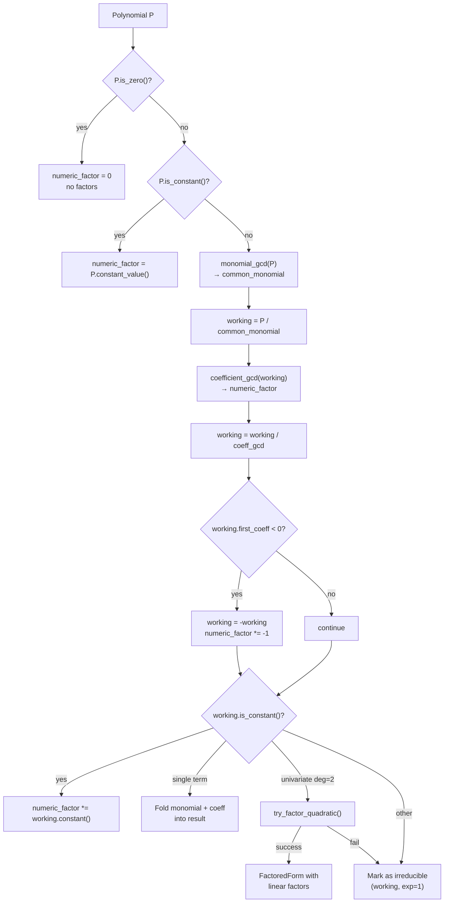

# Polynomial Factorization

> **Source:** `src/algebra/polynomial/factor.hpp`
>
> Extracts common factors and decomposes quadratic polynomials into irreducible linear factors.

---

## Overview

The factoring system takes a `Polynomial` and produces a `FactoredForm` — a structured representation of its factors. The algorithm is **staged**: it first extracts GCD factors (monomial and coefficient), normalizes the sign, then attempts quadratic factorization on what remains.

**Scope:** Currently limited to **univariate degree-2** polynomial factorization. Higher degrees and multivariate polynomials are returned as irreducible.

---

## FactoredForm

The result of factorization:

$$P = \mathrm{numericFactor} \times \mathrm{commonMonomial} \times \prod_i (\mathrm{factor}_i)^{e_i}$$

```cpp
struct FactoredForm {
    double numeric_factor;                                  // leading scalar (includes sign)
    Monomial common_monomial;                               // extracted GCD monomial
    std::vector<std::pair<Polynomial, int>> factors;        // (irreducible polynomial, exponent)
};
```

### `is_trivial()`

Returns `true` when no meaningful factorization occurred:
- `|numeric_factor − 1.0| < kCoeffTol`
- `common_monomial.is_constant()`
- Exactly one factor with exponent 1

### `to_string()`

Formatting rules:
- Trivial → return the single factor's string directly
- Numeric factor: suppressed if ≈ 1.0; shown as `"-"` if ≈ −1.0; otherwise rendered as number
- Common monomial: appended if non-constant
- Factors: each wrapped in `(...)`, exponent suppressed if 1, shown as `^e` otherwise
- **Example:** `2x(x - 3)(x + 1)^2`

---

## Factorization Pipeline



### Step-by-Step

1. **Zero check:** If polynomial is zero → `numeric_factor = 0`, empty factors. Done.

2. **Constant check:** If polynomial is a constant → `numeric_factor = value`. Done.

3. **Monomial GCD extraction:**
   ```
   common_monomial = P.monomial_gcd()
   If non-trivial (not constant 1):
       working = P.divide_by_monomial(common_monomial)
   ```
   Example: $x^3 + x^2$ → `common_monomial = x²`, `working = x + 1`

4. **Coefficient GCD extraction:**
   ```
   coeff_gcd = working.coefficient_gcd()
   If > 1:
       numeric_factor *= coeff_gcd
       working = working / coeff_gcd
   ```
   Example: $6x + 9$ → `coeff_gcd = 3`, `numeric_factor = 3`, `working = 2x + 3`

5. **Sign normalization:**
   If the leading coefficient of `working` is negative:
   ```
   working = -working
   numeric_factor *= -1
   ```
   Ensures the polynomial factor always has a positive leading term.

6. **Constant absorption:** If `working` is now constant → fold into `numeric_factor`. Done.

7. **Single-term absorption:** If `working` has exactly one term → fold its monomial into `common_monomial` and its coefficient into `numeric_factor`. Done.

8. **Quadratic factorization attempt:** If `working` is univariate and degree 2 → try `try_factor_quadratic()`. On success, factors are populated. On failure, fall through.

9. **Irreducible fallback:** Store `(working, 1)` as a single irreducible factor.

---

## Quadratic Factorization: `try_factor_quadratic()`

```cpp
bool try_factor_quadratic(const Polynomial& poly,
                          const std::string& var,
                          std::vector<std::pair<Polynomial, int>>& factors);
```

Attempts to factor a univariate degree-2 polynomial $ax^2 + bx + c$ into two linear factors $(px + q)(rx + s)$.

### Prerequisites

- Polynomial must be exactly degree 2
- Must be univariate
- All coefficients must be integers (within `kCoeffTol`)

### Algorithm

**Step 1 — Extract coefficients:**
```
a = coeff_of_degree(2)
b = coeff_of_degree(1)
c = coeff_of_degree(0)    // constant term
```

**Step 2 — Integer check:**
If `|coeff − round(coeff)| > kCoeffTol` for any of {a, b, c} → return `false`.

**Step 3 — Zero leading coefficient:**
If `a == 0` → return `false` (not actually a quadratic).

**Step 4 — Discriminant:**
$$\Delta = b^2 - 4ac$$
If $\Delta < 0$ → return `false` (complex roots only).

**Step 5 — Perfect square check:**
$$\sqrt{\Delta}_{\text{rounded}} = \text{round}(\sqrt{|\Delta|})$$
If $(\sqrt{\Delta}_{\text{rounded}})^2 \ne \Delta$ → return `false` (irrational discriminant).

**Step 6 — Divisor enumeration:**

The algorithm exhaustively searches for integer factors by enumerating divisors of $a$ and $c$:

```
For each divisor p of |a| (including 1 and |a|):
    For each divisor q of |c| (including 1 and |c|):
        r = a / p
        s = c / q
        Try all 16 sign combinations of (±p, ±q, ±r, ±s):
            If tp·tr == a AND tq·ts == c AND tp·ts + tq·tr == b:
                Found factorization!
```

The 16 sign combinations arise from independently negating each of the four values {p, q, r, s}: $2^4 = 16$.

**Step 7 — Normalization:**
Force positive leading coefficients in both factors (swap signs if needed).

**Step 8 — Canonicalization:**
- If both factors are identical → emit as squared: `(factor)^2`
- Otherwise → order by leading coefficient, then by constant term

### Complexity

$$O(\sqrt{|a|} \cdot \sqrt{|c|} \cdot 16)$$

The divisor enumeration is bounded by the square root of each coefficient (number of divisors), and each pair is tested with 16 sign combinations.

### Failure Modes

All return `false` without modifying `factors`:

| Condition                       | Reason                                      |
| ------------------------------- | ------------------------------------------- |
| Non-integer coefficients        | Divisor enumeration requires integers       |
| Negative discriminant           | Complex roots — no real factorization       |
| Non-perfect-square discriminant | Irrational roots — no integer factorization |
| Leading coefficient is zero     | Not a quadratic                             |
| No valid (p, q, r, s) found     | Coefficients are prime / irreducible        |

---

## Limitations

| Limitation                    | Rationale                                                                   |
| ----------------------------- | --------------------------------------------------------------------------- |
| **Univariate only**           | Multivariate factorization is combinatorially explosive                     |
| **Degree ≤ 2 only**           | Cubic/quartic factorization requires Galois theory techniques               |
| **Integer coefficients only** | Divisor enumeration doesn't work with irrational or fractional coefficients |
| **Real roots only**           | Complex-conjugate factor pairs are not produced                             |

Higher-degree univariate polynomials and multivariate polynomials are returned **unfactored** (as a single irreducible factor) after GCD extraction.

---

## Examples

| Input          | `FactoredForm`                 | String                               |
| -------------- | ------------------------------ | ------------------------------------ |
| $x^2 - 1$      | `{1.0, 1, [(x-1,1), (x+1,1)]}` | `(x - 1)(x + 1)`                     |
| $x^2 + 2x + 1$ | `{1.0, 1, [(x+1,2)]}`          | `(x + 1)^2`                          |
| $2x^3 + 4x^2$  | `{2.0, x², [(x+2,1)]}`         | `2x^2(x + 2)`                        |
| $-3x^2 + 6x$   | `{-3.0, x, [(x-2,1)]}`         | `-3x(x - 2)`                         |
| $x^2 + 1$      | `{1.0, 1, [(x²+1,1)]}`         | `x^2 + 1` (irreducible)              |
| $x^3 + 1$      | `{1.0, 1, [(x³+1,1)]}`         | `x^3 + 1` (irreducible — degree > 2) |
| $0$            | `{0.0, 1, []}`                 | `0`                                  |

---

## Invariant

The factored form always satisfies:

$$P_{\text{original}} \equiv \text{numericFactor} \times \text{commonMonomial} \times \prod_i \text{factor}_i^{e_i}$$

---

## Further Reading

- [Polynomial](polynomial.md) — `Polynomial` type, GCD operations used by factoring
- [AST → Polynomial](ast-to-poly.md) — How AST expressions are lowered before factoring
- [Polynomial Solver](poly-solver.md) — Root-finding (alternative to factoring for solving)
