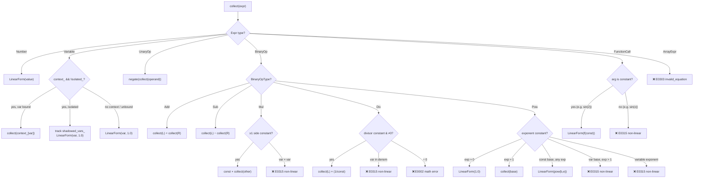

# Linear Collector

> **Source:** `src/algebra/linear/linear_collector.hpp`
>
> Extracts affine (linear) representations from AST expressions. Acts as the bridge between the math parser and the linear equation solver, with context-aware variable substitution.

---

## Overview

The `LinearCollector` traverses an `Expr` AST via the visitor pattern and accumulates a **linear form** — a map of variable coefficients plus a constant:

$$f(x, y, \ldots) = c_1 x + c_2 y + \ldots + k$$

Any construct that produces a non-linear term (e.g. `x * y`, `x^2`, `sin(x)`) is **rejected** with a `Diagnostic`.

---

## LinearForm

`LinearForm` is a lightweight value type representing an affine expression.

### Data Members

```cpp
struct LinearForm {
    std::map<std::string, double> coeffs;   // variable → coefficient
    double constant = 0.0;                   // constant bias term
};
```

The `coeffs` map preserves alphabetical (lexicographic) variable ordering because it uses `std::map<std::string, double>`.

### Constructors

| Constructor                            | Result                | Example                        |
| -------------------------------------- | --------------------- | ------------------------------ |
| `LinearForm()`                         | Zero form: $0$        | `constant = 0`, empty `coeffs` |
| `LinearForm(double c)`                 | Constant: $c$         | `LinearForm(5.0)` → $5$        |
| `LinearForm(string var, double coeff)` | Monomial: $c \cdot x$ | `LinearForm("x", 3.0)` → $3x$  |

### Arithmetic Operators

All operators return a **new** `LinearForm`.

| Operator | Semantics                   | Formula                                               |
| -------- | --------------------------- | ----------------------------------------------------- |
| `a + b`  | Pointwise sum               | $\text{coeffs}[v] = a[v] + b[v], \; k = a_k + b_k$    |
| `a - b`  | Pointwise difference        | $\text{coeffs}[v] = a[v] - b[v], \; k = a_k - b_k$    |
| `a * s`  | Scalar multiplication       | $\text{coeffs}[v] = a[v] \cdot s, \; k = a_k \cdot s$ |
| `-a`     | Negation (calls `a * -1.0`) | $-f(x)$                                               |

### Query Methods

| Method           | Return                  | Description                                                           |
| ---------------- | ----------------------- | --------------------------------------------------------------------- |
| `get_coeff(var)` | `double`                | Returns coefficient of `var`, or `0.0` if absent. No exception.       |
| `variables()`    | `std::set<std::string>` | All variables with $\left\lvert \text{coeff} \right\rvert > \epsilon$ |
| `is_constant()`  | `bool`                  | True iff all $\left\lvert \text{coeff} \right\rvert \le \epsilon$     |

### `simplify(epsilon)`

Prunes floating-point noise — removes entries that are effectively zero:

```
For each (variable, coefficient) in coeffs:
    If |coefficient| < epsilon:
        Erase from map
If |constant| < epsilon:
    Set constant = 0.0
```

This prevents spurious terms from accumulating due to floating-point cancellation (e.g. `1e-16` after subtraction).

---

## LinearCollector

The visitor class that converts an `Expr` AST into a `LinearForm`.

### Internal State

| Field            | Type                        | Purpose                                                                      |
| ---------------- | --------------------------- | ---------------------------------------------------------------------------- |
| `result_`        | `LinearForm`                | Accumulates the collected form                                               |
| `error_`         | `std::optional<Diagnostic>` | First error encountered (once set, all visitors short-circuit)               |
| `context_`       | `const Context*`            | Variable bindings for substitution (nullable)                                |
| `input_`         | `std::string`               | Raw source text for diagnostic span labelling                                |
| `isolated_`      | `bool`                      | When true, context substitution is disabled                                  |
| `shadowed_vars_` | `std::set<std::string>`     | Variables that exist in context but were treated as unknowns (isolated mode) |

### Constructors

```cpp
LinearCollector();                                              // no context
LinearCollector(const Context* ctx, bool isolated);             // with context
LinearCollector(const Context* ctx, const std::string& input,
                bool isolated);                                 // full
```

### Entry Point: `collect(expr)`

```cpp
Result<LinearForm> collect(const Expr& expr);
```

1. **Resets** `result_`, `error_`, `shadowed_vars_` (allows reuse of the collector)
2. Calls `expr.accept(*this)` — dispatches to the appropriate `visit()` method
3. If `error_` is set → returns `Result::err(error_)`
4. Otherwise → calls `result_.simplify()` and returns `Result::ok(result_)`

---

## AST Node Dispatch



---

## Visitor Methods — Detailed

### `visit(Number)`

Stores the numeric value as a constant linear form:

```
result_ = LinearForm(node.value())
```

Always succeeds.

### `visit(Variable)`

Three-way decision based on context and isolation mode:

1. **Context exists, not isolated, variable is bound:**
   Recursively visits the stored expression from context — effectively inlines the definition.
   ```
   :set a 2*x + 1
   collect(a) → collect(2*x + 1) → LinearForm({x: 2.0}, 1.0)
   ```

2. **Context exists, isolated mode, variable is bound:**
   Records the variable name in `shadowed_vars_` for diagnostic warnings, but treats it as an unknown:
   ```
   result_ = LinearForm("a", 1.0)
   shadowed_vars_.insert("a")
   ```

3. **No context, or variable not bound:**
   Stores as a unit monomial:
   ```
   result_ = LinearForm(name, 1.0)
   ```

### `visit(UnaryOp)`

Only handles `UnaryOpType::Neg`:

1. Early return if `error_` is already set
2. Recursively visit the operand
3. Negate: `result_ = -result_`

### `visit(BinaryOp)`

The most complex visitor. Handles five operators with linearity enforcement:

#### Add / Sub

```
collect(left) ± collect(right)
```

No linearity constraints — addition/subtraction of linear forms is always linear.

#### Mul

1. Collect both sides independently
2. Check which (if any) is constant:
   - **Left constant:** `result_ = right * left.constant`
   - **Right constant:** `result_ = left * right.constant`
   - **Both have variables:** Error — "non-linear term: variables multiplied together"

#### Div

1. Collect both sides
2. **Divisor has variables:** Error — "division by variable"
3. **Divisor ≈ 0** (within `kEpsilon`): Error — "division by zero"
4. **Divisor is constant & non-zero:** `result_ = left * (1.0 / divisor.constant)`

#### Pow

1. Collect both sides
2. **Exponent has variables:** Error — "variable exponent"
3. **Exponent is constant:**
   - $\text{exp} \approx 0$ (within `kEpsilon`): Always `LinearForm(1.0)` (even `0^0 = 1`)
   - $\text{exp} \approx 1$ (within `kEpsilon`): Identity — return base
   - Base is constant: Evaluate `std::pow(base, exp)` → `LinearForm(result)`
   - Base has variables, exp ≠ {0, 1}: Error — "variable raised to power N"

### `visit(FunctionCall)`

1. Recursively evaluate the argument to get a `LinearForm`
2. If argument has variables → Error: "function 'name' applied to variable expression"
3. If argument is constant → numerically evaluate using the function kind:

| `FuncKind` | C++ Function    |
| ---------- | --------------- |
| `Sin`      | `std::sin(x)`   |
| `Cos`      | `std::cos(x)`   |
| `Tan`      | `std::tan(x)`   |
| `Asin`     | `std::asin(x)`  |
| `Acos`     | `std::acos(x)`  |
| `Atan`     | `std::atan(x)`  |
| `Sinh`     | `std::sinh(x)`  |
| `Cosh`     | `std::cosh(x)`  |
| `Tanh`     | `std::tanh(x)`  |
| `Exp`      | `std::exp(x)`   |
| `Sqrt`     | `std::sqrt(x)`  |
| `Ln`       | `std::log(x)`   |
| `Log`      | `std::log(x)`   |
| `Abs`      | `std::abs(x)`   |
| `Floor`    | `std::floor(x)` |
| `Ceil`     | `std::ceil(x)`  |
| `Round`    | `std::round(x)` |

Examples:
- `sin(3.14)` → evaluates to `LinearForm(≈0.0016)` ✓
- `sin(x)` → rejects with E0315 ✗

### `visit(ArrayExpr)`

Unconditionally rejected with `errors::invalid_equation()` (E0303). Arrays cannot appear in linear equations.

---

## Non-Linearity Rejection Table

| Construct                             | Error Code | Message                                          |
| ------------------------------------- | ---------- | ------------------------------------------------ |
| `x * y`                               | E0315      | "non-linear term: variables multiplied together" |
| `x ^ n` (n ≠ 0, 1; base not constant) | E0315      | "variable raised to power N"                     |
| `expr / x`                            | E0315      | "division by variable"                           |
| `x ^ y` (variable exponent)           | E0315      | "variable exponent"                              |
| `sin(x)`, `cos(x)`, etc.              | E0315      | "function 'sin' applied to variable expression"  |
| `[1, 2, 3]`                           | E0303      | "array value cannot appear"                      |
| `expr / 0`                            | E0002      | "division by zero"                               |

---

## Error Handling Pattern

The collector uses a **first-error-wins** strategy:

1. `error_` is `std::optional<Diagnostic>` — initially empty
2. When any visitor detects a problem, it sets `error_` and returns
3. All subsequent `visit()` calls check `if (error_) return;` as the first statement
4. After traversal, `collect()` checks `error_` and returns `Result::err()` or `Result::ok()`

This means only the **first** non-linearity is reported. For example, in `x^2 + sin(y)`, only the `x^2` error is returned.

---

## Context-Aware Substitution

### Non-Isolated Mode (default)

When `context_` is provided and `isolated_ == false`, bound variables are **transparently substituted**:

```
Context: { a = 2*x + 1 }
Input: a + 3 = 10

visit(Variable "a") → finds context binding → visit(2*x + 1)
Result: LinearForm({x: 2.0}, 4.0)   [i.e., 2x + 4]
```

Substitution is **recursive** — if `a` references `b` which references `c`, the collector follows the chain.

### Isolated Mode

When `isolated_ == true`, context bindings are **ignored** but **tracked**:

```
Context: { a = 2*x + 1 }
Input: a + 3 = 10 (isolated)

visit(Variable "a") → a is in context → add to shadowed_vars_
Result: LinearForm({a: 1.0}, 3.0)   [i.e., a + 3]
```

The caller (typically `Simplifier`) can inspect `shadowed_variables()` to emit warnings like "variable 'a' shadows context variable".

---

## Further Reading

- [Simplify](simplify.md) — Consumes `LinearForm` to produce canonical equation strings
- [Linear Solver](solver.md) — Solves `LinearForm` equations for a single variable
- [Matrix Solver](matrix-solver.md) — Solves systems of `LinearForm` equations
- [Tolerance](tolerance.md) — `kEpsilon` constant used for near-zero tests
- [AST](../../architecture/ast.md) — The expression nodes handled by the collector
