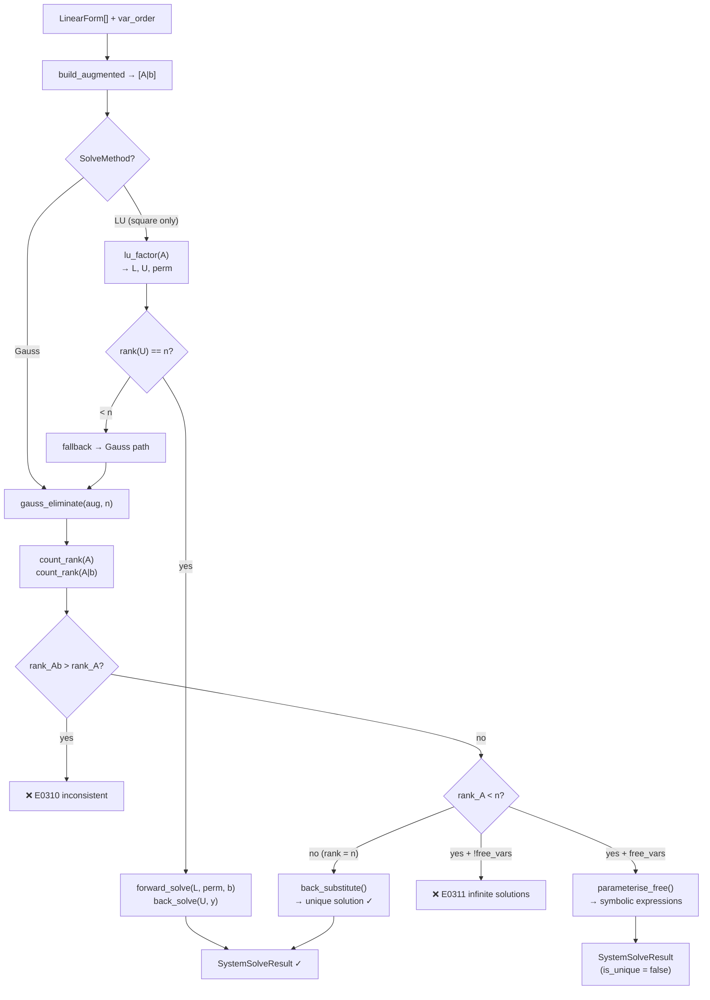

# Matrix Solver (Linear Systems)

> **Sources:** `src/algebra/matrix/matrix_solver.hpp`, `src/algebra/matrix/matrix_solver.cpp`, `src/algebra/matrix/solve_method.hpp`
>
> Solves systems of $n$ linear equations in $m$ unknowns using Gaussian elimination (with partial pivoting) or LU decomposition.

---

## Overview

The `MatrixSolver` takes a vector of `LinearForm` objects (one per equation) and a variable ordering, builds an augmented matrix $[A|b]$, and applies either Gaussian elimination or LU decomposition to find the solution.



---

## Data Types

### `SolveMethod` Enum

```cpp
enum class SolveMethod {
    Gauss,   // Gaussian elimination with partial pivoting (default)
    LU,      // LU decomposition via Doolittle with partial pivoting
};
```

### `SolveSystemOptions`

```cpp
struct SolveSystemOptions {
    SolveMethod method = SolveMethod::Gauss;
    bool free_vars = false;   // parameterize underdetermined systems
};
```

| Field       | Default | Purpose                                                                             |
| ----------- | ------- | ----------------------------------------------------------------------------------- |
| `method`    | `Gauss` | Algorithm selection                                                                 |
| `free_vars` | `false` | When `true`, underdetermined systems produce symbolic expressions instead of errors |

### `SystemSolveResult`

```cpp
struct SystemSolveResult {
    std::map<std::string, double>      solutions;       // variable → value
    std::map<std::string, std::string> free_params;     // variable → parametric expression
    std::vector<std::string>           free_vars;       // names of free variables
    bool   is_unique;                                    // true iff unique solution
    int    rank_A;                                       // rank of coefficient matrix
    int    rank_Ab;                                      // rank of augmented matrix
    double smallest_pivot;                               // diagnostic: smallest pivot seen
};
```

| Field                | When Populated                                                              |
| -------------------- | --------------------------------------------------------------------------- |
| `solutions`          | Always (for unique); for pivot variables (underdetermined with `free_vars`) |
| `free_params`        | Only when `free_vars == true` and system is underdetermined                 |
| `free_vars`          | Names of free (non-pivot) variables                                         |
| `is_unique`          | `true` iff `rank_A == n` (full rank)                                        |
| `rank_A` / `rank_Ab` | Always — used for rank analysis                                             |
| `smallest_pivot`     | Diagnostic for numerical stability assessment                               |

---

## MatrixSolver Class

### State

```cpp
class MatrixSolver {
    std::string input_;   // source text for diagnostics
};
```

### Entry Point

```cpp
Result<SystemSolveResult> solve(
    const std::vector<LinearForm>& forms,
    const std::vector<std::string>& var_order,
    const SolveSystemOptions& opts = {});
```

**Preconditions:**
- `forms` is non-empty
- `var_order` is non-empty
- Each `forms[i]` represents: $\sum_j \text{coeffs}[j] \cdot \text{var}[j] + \text{constant} = 0$

**Convention:** The constant in `LinearForm` is on the same side as the variables, so the augmented matrix uses $b_i = -\text{forms}[i].\text{constant}$.

---

## Augmented Matrix Construction

### `build_augmented(forms, var_order)` → Matrix

Builds an $m \times (n+1)$ augmented matrix $[A|b]$:

```
For each equation i:
    For each variable j:
        A[i][j] = forms[i].get_coeff(var_order[j])
    b[i] = -forms[i].constant
```

The matrix type is `std::vector<std::vector<double>>`.

---

## Gaussian Elimination with Partial Pivoting

### `gauss_eliminate(mat, n)` → `double` (smallest pivot)

In-place transformation of the augmented matrix to row echelon form.

### Algorithm

For each column $k = 0, 1, \ldots, n-1$:

**Step 1 — Partial Pivoting:**
Find the row at or below $k$ with the largest absolute value in column $k$:
```
pivot_row = argmax_{i ≥ k} |mat[i][k]|
```
Swap rows `k` and `pivot_row` (full row swap including the augmented column).

Skip column if $|\text{max pivot}| < \epsilon$ (effectively-zero column → rank deficient).

**Step 2 — Forward Elimination:**
For each row $i > k$:
```
factor = mat[i][k] / mat[k][k]
For each column j = k..n:
    mat[i][j] -= factor * mat[k][j]
mat[i][k] = 0.0    // forced exact zero
```

The forced zero prevents floating-point noise from propagating.

**Returns:** The smallest absolute pivot encountered (used for singularity diagnostics).

### `count_rank(mat, col_limit)` → `int`

Counts non-zero rows in the first `col_limit` columns:

```
rank = 0
For each row:
    If any |mat[row][col]| > kPivotTol for col < col_limit:
        rank++
```

Used twice:
- `count_rank(aug, n)` → `rank_A` (coefficient matrix rank)
- `count_rank(aug, n+1)` → `rank_Ab` (augmented matrix rank)

---

## Back-Substitution

### `back_substitute(mat, n, x)` → `void`

Solves a row-echelon system for a unique solution.

**Precondition:** `rank_A == n` (square, full rank).

**Algorithm:**

1. **Identify pivot columns:** For each row, find the first non-zero entry (leading coefficient)
2. **Back-substitute** from the last row upward:
```
For row = n-1 down to 0:
    pivot_col = pivot_columns[row]
    sum = mat[row][n]    // RHS value
    For col > pivot_col:
        sum -= mat[row][col] * x[col]
    x[pivot_col] = sum / mat[row][pivot_col]
```

Output is written into vector `x` of size $n$.

---

## LU Decomposition

### `lu_factor(lu, perm, n)` → `double` (smallest pivot)

**Algorithm:** Doolittle with partial pivoting.

Factors the $n \times n$ coefficient matrix in-place:
- **L** stored below the diagonal (unit diagonal implied — $L_{ii} = 1$)
- **U** stored on and above the diagonal

For each step $k = 0, 1, \ldots, n-1$:

**Partial pivoting:**
```
Find max |lu[i][k]| for i = k..n-1
Swap rows lu[k] and lu[best], update perm[k] ↔ perm[best]
```

**L and U computation:**
```
For each row i > k:
    L[i][k] = lu[i][k] / lu[k][k]      // multiplier
    For each col j > k:
        lu[i][j] -= L[i][k] * lu[k][j]  // U update
```

Skips singular columns where $|\text{pivot}| < \epsilon$.

**Permutation tracking:** `perm[i]` records the original row index for position $i$.

### `forward_solve(lu, perm, b, n)` → `vector<double>`

Solves $Ly = Pb$ (unit lower-triangular):

```
For i = 0 to n-1:
    y[i] = b[perm[i]]
    For j = 0 to i-1:
        y[i] -= lu[i][j] * y[j]
```

### `back_solve(lu, y, n)` → `vector<double>`

Solves $Ux = y$ (upper-triangular):

```
For i = n-1 down to 0:
    x[i] = y[i]
    For j = i+1 to n-1:
        x[i] -= lu[i][j] * x[j]
    x[i] /= lu[i][i]
```

---

## Free Variable Parameterization

### `parameterise_free(mat, var_order, free_var_names)` → `map<string, string>`

For underdetermined systems (when `opts.free_vars == true` and `rank_A < n`).

### Algorithm

**Step 1 — Identify pivot and free columns:**
```
For each row: find leading non-zero → pivot_col
Columns without a pivot → free variables
```

**Step 2 — Assign parameter names:**
Free variables are renamed to $t_0, t_1, \ldots$ for symbolic output.

**Step 3 — Express pivot variables:**
Working from the last row upward (back-substitution style):
```
For each pivot variable x[p]:
    expression = RHS constant term
    For each free variable f:
        expression += coefficient * parameter_name
    Emit: "x_p = expression_string"
```

**Step 4 — Coefficient formatting:**
- ±1 coefficients: suppressed (show `t0` not `1t0`, `-t0` not `-1t0`)
- Decimal cleanup: trailing zeros stripped, trailing decimal point removed
- Terms assembled with `+` / `−` infix

### Example Output

System: $x + 2y + z = 5,\; x + y = 3$

With `rank_A = 2`, `n = 3`, free variable: $z$

```
x = 1 + t0
y = 2 - t0
z = t0     (free)
```

---

## Control Flow Summary

### Gauss Path (default)

1. `build_augmented()` → $[A|b]$
2. `gauss_eliminate(aug, n)` → row echelon form + smallest pivot
3. `count_rank(aug, n)` → `rank_A`
4. `count_rank(aug, n+1)` → `rank_Ab`
5. **Consistency check:** `rank_Ab > rank_A` → E0310 (no solution)
6. **Under-determined:** `rank_A < n`
   - `free_vars == true` → `parameterise_free()`
   - `free_vars == false` → E0311 (infinite solutions)
7. **Unique solution:** `back_substitute()` → populate `solutions`

### LU Path (square systems only)

1. `build_augmented()` → extract $A$ and $b$
2. `lu_factor(A)` → $L$, $U$, permutation + smallest pivot
3. **Rank check on U:** count non-zero diagonals
4. **Cross-validate:** run Gauss elimination separately on full augmented to get true `rank_Ab`
5. **Consistency check:** `rank_Ab > rank_A` → E0310
6. **Under-determined:** `rank_A < n` → fallback to Gauss path (for parameterization)
7. **Unique solution:** `forward_solve()` → `back_solve()` → populate `solutions`

**Note:** LU is only used for square systems ($m = n$). Rectangular systems always use Gauss.

---

## Rank Analysis

| `rank_A`  | `rank_Ab`          | Interpretation                                              | Result                                    |
| --------- | ------------------ | ----------------------------------------------------------- | ----------------------------------------- |
| $= n = m$ | $= n$              | Fully determined, consistent                                | **Unique solution**                       |
| $< n$     | $= \text{rank\_A}$ | Underdetermined, consistent                                 | **Infinite solutions** (or parameterized) |
| Any       | $> \text{rank\_A}$ | Inconsistent row $[0 \; 0 \; \ldots \; 0 \;\mid\; c \ne 0]$ | **No solution**                           |

---

## Numerical Stability

### Partial Pivoting

Both Gaussian elimination and LU decomposition use **partial pivoting** — selecting the row with the largest absolute value in the current column as the pivot. This reduces error amplification from small divisors.

### Forced Zeros

After elimination, the entry below the pivot is explicitly set to `0.0`:
```cpp
mat[i][k] = 0.0;   // forced exact zero
```

This prevents accumulated floating-point rounding from creating spurious rank.

### Singularity Detection

The `smallest_pivot` value is tracked during elimination. A very small pivot (near `kPivotTol`) indicates the system is near-singular. The value is included in `SystemSolveResult` for diagnostic purposes.

---

## Tolerance Constants

| Constant              | Value                                                          | Usage in Matrix Solver |
| --------------------- | -------------------------------------------------------------- | ---------------------- |
| `kEpsilon` (`1e-12`)  | Skip columns with pivot below this in elimination              |
| `kPivotTol` (`1e-10`) | Threshold for rank determination in `count_rank()`             |
| `kCoeffTol` (`1e-9`)  | Coefficient formatting in `parameterise_free()` (±1 detection) |

---

## Error Codes

| Code  | Factory                       | Trigger                                                                               |
| ----- | ----------------------------- | ------------------------------------------------------------------------------------- |
| E0310 | `system_no_solution()`        | `rank_Ab > rank_A` (inconsistent system)                                              |
| E0310 | `system_no_solution()`        | Empty `forms` or `var_order`                                                          |
| E0311 | `system_infinite_solutions()` | `rank_A < n` and `!opts.free_vars`. Help: "use --free-vars to see parameterised form" |

---

## Examples

| System                       | Method              | Result                                        |
| ---------------------------- | ------------------- | --------------------------------------------- |
| $x + y = 3,\; x - y = 1$     | Gauss               | $x = 2, y = 1$ (unique)                       |
| $x + y = 1,\; x + y = 2$     | Gauss               | E0310 (inconsistent)                          |
| $x + y + z = 6,\; x - y = 0$ | Gauss + `free_vars` | $x = 3 - 0.5t_0,\; y = 3 - 0.5t_0,\; z = t_0$ |
| $x + y = 3,\; x - y = 1$     | LU                  | $x = 2, y = 1$ (same as Gauss)                |

---

## Further Reading

- [Linear Collector](linear-collector.md) — Produces the `LinearForm` inputs for the matrix solver
- [Linear Solver](solver.md) — Single-equation alternative
- [Tolerance](tolerance.md) — `kEpsilon`, `kPivotTol`, `kCoeffTol` constants
