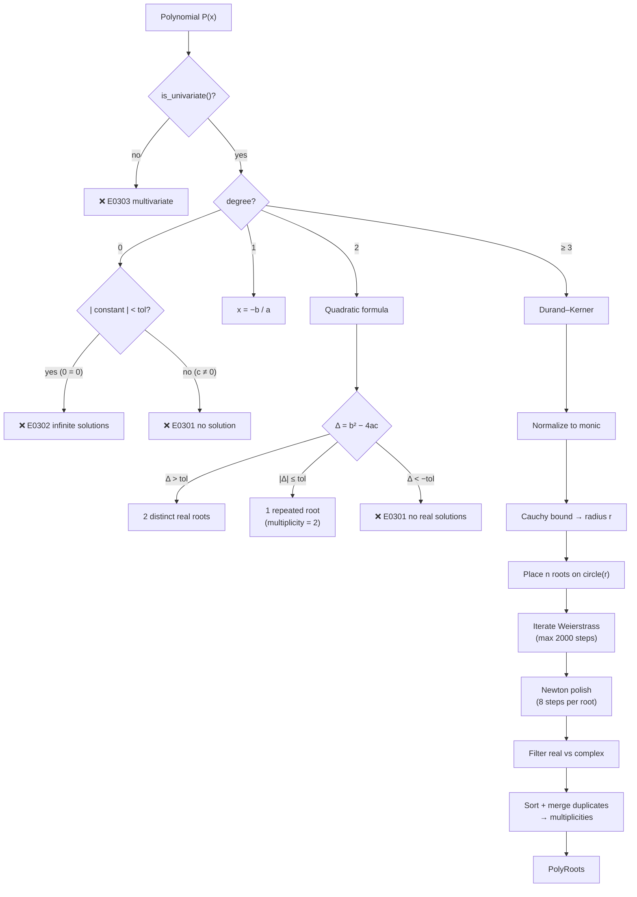

# Polynomial Equation Solver

> **Source:** `src/algebra/solver/poly_solver.hpp`
>
> Finds real roots of univariate polynomial equations $P(x) = 0$ using exact methods for degree ≤ 2 and numerical iteration for degree ≥ 3.

---

## Overview

`PolynomialSolver` dispatches by degree:

| Degree | Method                           | Precision              |
| ------ | -------------------------------- | ---------------------- |
| 0      | Constant check                   | Exact                  |
| 1      | $x = -b/a$                       | Exact                  |
| 2      | Quadratic formula                | Exact (floating-point) |
| ≥ 3    | Durand–Kerner + Newton polishing | Numerical              |

The class is **stateless** and **thread-safe** — all state is local to the `solve()` call.

---

## PolyRoots

Result container for polynomial root-finding.

```cpp
struct PolyRoots {
    std::vector<double>              real_roots;       // real roots, sorted ascending
    std::vector<std::complex<double>> all_roots;       // all complex roots (including real)
    std::vector<int>                 multiplicities;   // parallel to real_roots
    int                              complex_count = 0; // complex-only roots discarded
};
```

| Field            | Description                                                                  |
| ---------------- | ---------------------------------------------------------------------------- |
| `real_roots`     | Real roots sorted in ascending order. Length equals `multiplicities.size()`. |
| `all_roots`      | All roots from the solver (real + complex). Used for diagnostics.            |
| `multiplicities` | Parallel to `real_roots`. A value > 1 indicates a repeated root.             |
| `complex_count`  | Number of roots with non-negligible imaginary part.                          |

### `has_real()`

Returns `true` if at least one real root was found.

---

## Degree Dispatch



---

## `solve()` Entry Point

```cpp
Result<PolyRoots> solve(const Polynomial& poly,
                        const std::string& input = "",
                        double tol = kCoeffTol) const;
```

| Parameter | Default            | Purpose                                                                       |
| --------- | ------------------ | ----------------------------------------------------------------------------- |
| `poly`    | —                  | Univariate polynomial ($\text{LHS} - \text{RHS}$ already normalized to $= 0$) |
| `input`   | `""`               | Raw source text for diagnostic span labelling                                 |
| `tol`     | `kCoeffTol` (1e-9) | Tolerance for imaginary filtering and root deduplication                      |

### Pre-check

If `!poly.is_univariate()` → E0303 error.

---

## Degree 0: Constant

```cpp
double c = poly.constant_value();
if (|c| < tol)  → E0302 infinite solutions (0 = 0)
else             → E0301 no solution (c ≠ 0)
```

---

## Degree 1: Linear

```cpp
double a = coeffs[0];   // x^1 coefficient
double b = coeffs[1];   // constant term
```

If $|a| < \text{tol}$ → degenerate (constant check). Otherwise:

$$x = \frac{-b}{a}$$

Returns single root with multiplicity 1.

---

## Degree 2: Quadratic Formula

### `solve_quadratic(coeffs, tol, input)`

For $ax^2 + bx + c = 0$:

$$\Delta = b^2 - 4ac$$

Three cases:

| Discriminant                                     | Roots                 | Result                                                                                                   |
| ------------------------------------------------ | --------------------- | -------------------------------------------------------------------------------------------------------- |
| $\Delta > \text{tol}$                            | Two distinct real     | $x = \frac{-b \pm \sqrt{\Delta}}{2a}$, each with multiplicity 1                                          |
| $\left\lvert \Delta \right\rvert \le \text{tol}$ | One repeated real     | $x = \frac{-b}{2a}$, multiplicity 2                                                                      |
| $\Delta < -\text{tol}$                           | Two complex conjugate | E0301 error. `all_roots` populated with $\frac{-b}{2a} \pm \frac{\sqrt{-\Delta}}{2a} i$ for diagnostics. |

Roots are sorted ascending. If `r1 > r2` after computation, they are swapped.

---

## Degree ≥ 3: Durand–Kerner (Weierstrass) Method

### `solve_numerical(coeffs, deg, tol, input)`

A simultaneous iterative root-finder for all $n$ roots in the complex plane.

### Step 1 — Normalize to Monic

Divide all coefficients by the leading coefficient $a_n$:

$$\hat{a}_i = \frac{a_i}{a_n}$$

This ensures the polynomial has the form $x^n + \hat{a}_{n-1}x^{n-1} + \ldots + \hat{a}_0$.

### Step 2 — Cauchy's Root Bound

Compute a radius that bounds all roots:

$$r = 1 + \max_i |\hat{a}_i|$$

All roots of the polynomial lie within the disk $|z| \le r$ in the complex plane.

### Step 3 — Initial Approximations

Place $n$ starting points evenly on a circle of radius $r$:

$$z_k^{(0)} = r \cdot e^{i(2\pi k / n + \pi / 2n)}, \quad k = 0, 1, \ldots, n-1$$

The offset angle $\frac{\pi}{2n}$ avoids placing initial points on real/imaginary axes, reducing the chance of symmetry-induced stagnation.

### Step 4 — Weierstrass Iteration

For each iteration (up to **2000** steps):

$$z_i^{\text{new}} = z_i - \frac{p(z_i)}{\displaystyle\prod_{j \ne i} (z_i - z_j)}$$

```
For each root i = 0..n-1:
    num = eval_poly_c(monic, z[i])        // Horner evaluation
    den = ∏_{j≠i} (z[i] - z[j])
    If |den| < 1e-300: skip (near-zero guard)
    delta = num / den
    z[i] -= delta
    max_delta = max(max_delta, |delta|)

If max_delta < tol × 1e-3: converged → break
```

**Convergence criterion:** The maximum update magnitude across all roots falls below $\text{tol} \times 10^{-3}$.

### Step 5 — Newton Polishing

Each root is refined with **8 steps** of Newton's method:

$$z_i \leftarrow z_i - \frac{p(z_i)}{p'(z_i)}$$

The derivative $p'(z_i)$ is computed via Horner's method:

```
dfx = monic[0]
For k = 1 to n-1:
    dfx = dfx * z[i] + monic[k]
```

Guard: if $|p'(z_i)| < 10^{-300}$, the step is skipped (near-stationary point).

### Step 6 — Root Classification

Each root is classified as **real** or **complex**:

$$|z.\text{imag}| \le \text{tol} \times \max(1, |z.\text{real}|)$$

The scaling by $\max(1, |z.\text{real}|)$ makes the threshold relative for large roots and absolute for roots near zero.

- Real candidates → collected into `real_cands`
- Complex roots → increment `complex_count`

### Step 7 — Deduplication and Multiplicity

Real roots are sorted and merged:

```
Sort real_cands ascending
i = 0
While i < real_cands.size():
    val = real_cands[i]
    mult = 1
    j = i + 1
    While j < size AND |real_cands[j] - val| ≤ tol × max(1, |val|):
        mult++
        j++
    Emit (val, mult)
    i = j
```

Roots within the tolerance window are merged, incrementing multiplicity.

### Step 8 — Error Check

If `real_roots` is empty after classification → E0301 (no real solutions).

---

## Horner's Evaluation: `eval_poly_c()`

Evaluates a polynomial at a complex point using **Horner's scheme**:

```cpp
std::complex<double> eval_poly_c(const vector<double>& c,
                                  std::complex<double> x) const;
```

For coefficients $[a_n, a_{n-1}, \ldots, a_0]$ (highest to lowest degree):

$$p(x) = (\ldots((a_n \cdot x + a_{n-1}) \cdot x + a_{n-2}) \cdot x + \ldots) + a_0$$

This is numerically stable and costs $O(n)$ multiplications and additions.

---

## Coefficient Extraction: `extract_coeffs()`

```cpp
std::vector<double> extract_coeffs(const Polynomial& poly,
                                   const std::string& var, int deg) const;
```

Produces a vector of size $\text{deg} + 1$ ordered **highest to lowest degree**:

$$[a_n, a_{n-1}, \ldots, a_1, a_0]$$

- Index 0 → leading coefficient $a_n$ (degree $n$)
- Index $\text{deg}$ → constant term $a_0$ (degree 0)

This ordering is required by both Horner's evaluation and the Durand–Kerner iteration.

---

## Configuration

| Parameter             | Value                                               | Purpose                                            |
| --------------------- | --------------------------------------------------- | -------------------------------------------------- |
| Max iterations        | 2000                                                | Upper bound on Weierstrass iterations              |
| Convergence threshold | `tol × 1e-3`                                        | Required precision for convergence                 |
| Newton polish steps   | 8                                                   | Post-iteration refinement per root                 |
| Initial radius        | $1 + \max \left\lvert \hat{a}_i \right\rvert$       | Cauchy's bound on root magnitude                   |
| Imaginary threshold   | $tol × max(1, \left\lvert \text{re} \right\rvert )$ | Classify root as real vs complex                   |
| Near-zero guard       | `1e-300`                                            | Skip iteration if denominator/derivative too small |

---

## Examples

| Polynomial             | Degree | Method        | Real Roots  | Multiplicities    |
| ---------------------- | ------ | ------------- | ----------- | ----------------- |
| $x + 1$                | 1      | Exact         | $[-1]$      | $[1]$             |
| $x^2 - 4$              | 2      | Quadratic     | $[-2, 2]$   | $[1, 1]$          |
| $x^2 + 2x + 1$         | 2      | Quadratic     | $[-1]$      | $[2]$             |
| $x^2 + 1$              | 2      | Quadratic     | —           | E0301 (Δ < 0)     |
| $x^3 - 6x^2 + 11x - 6$ | 3      | Durand–Kerner | $[1, 2, 3]$ | $[1, 1, 1]$       |
| $x^3 + 1$              | 3      | Durand–Kerner | $[-1]$      | $[1]$ (2 complex) |

---

## Further Reading

- [Polynomial](polynomial.md) — The `Polynomial` type consumed by this solver
- [Linear Solver](solver.md) — Simpler solver for linear-only equations
- [AST → Polynomial](ast-to-poly.md) — How expressions are lowered to `Polynomial`
- [Tolerance](tolerance.md) — `kCoeffTol` used as default tolerance
