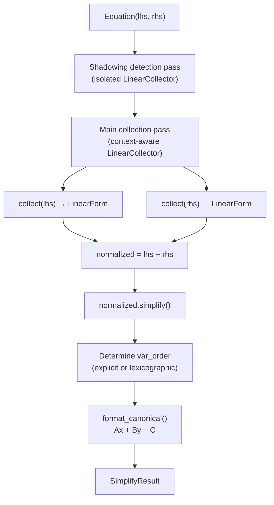

# Simplify

> **Sources:** `src/algebra/linear/simplify.hpp`, `src/core/fraction.hpp`
>
> Converts equations and expressions to canonical form: $Ax + By + \ldots = C$. Context-aware with shadowing detection and optional fraction output.

---

## Overview

The `Simplifier` orchestrates canonicalization of linear equations and expressions. It:

1. Uses `LinearCollector` to extract `LinearForm` from both sides
2. Normalizes to $\text{LHS} - \text{RHS} = 0$ (moves all terms left, constant right)
3. Orders variables deterministically
4. Formats the result as a human-readable string



---

## SimplifyOptions

Configuration for canonicalization behaviour.

```cpp
struct SimplifyOptions {
    std::vector<std::string> var_order;   // explicit variable ordering (empty = lex)
    bool isolated        = false;          // if true, context vars not substituted
    bool as_fraction     = false;          // if true, use fractional coefficients
    bool show_zero_coeffs = false;         // if true, include zero-coefficient variables
};
```

| Field              | Default      | Effect                                                                                     |
| ------------------ | ------------ | ------------------------------------------------------------------------------------------ |
| `var_order`        | `{}` (empty) | Variables appear in lexicographic order. Provide a list to force a specific order.         |
| `isolated`         | `false`      | Context-bound variables are substituted. Set `true` to treat them as unknowns.             |
| `as_fraction`      | `false`      | Coefficients are formatted as decimals. Set `true` for `(1/3)x` instead of `0.333333x`.    |
| `show_zero_coeffs` | `false`      | Variables with zero coefficient are omitted. Set `true` to keep them (e.g. `0x + 2y = 5`). |

---

## SimplifyResult

The output of a simplification operation.

```cpp
struct SimplifyResult {
    LinearForm                form;       // collected & simplified form (LHS − RHS)
    std::vector<std::string>  var_order;  // variable ordering used in output
    std::string               canonical;  // formatted string: "2x + 3y = 7"
    std::set<std::string>     warnings;   // non-fatal warnings (shadowing, etc.)
};
```

### Analysis Predicates

| Method                    | Returns `true` when                                                        | Meaning                                                     |
| ------------------------- | -------------------------------------------------------------------------- | ----------------------------------------------------------- |
| `is_no_solution()`        | `form.is_constant()` && $\left\lvert form.constant \right\vert > kEpsilon$ | Equation reduces to `c = 0` where $c \ne 0$ (contradiction) |
| `is_infinite_solutions()` | `form.is_constant()` && $\left\lvert form.constant \right\vert ≤ kEpsilon$ | Equation reduces to `0 = 0` (tautology)                     |

Examples:
- `2x + 3 = 2x + 5` → `form = {constant: -2}` → `is_no_solution() == true`
- `x + 1 = x + 1` → `form = {constant: 0}` → `is_infinite_solutions() == true`

---

## Simplifier

Class that orchestrates equation/expression canonicalization.

### State

```cpp
class Simplifier {
    const Context* context_;    // for variable substitution (nullable)
    std::string    input_;      // source text for diagnostics
};
```

### Constructors

```cpp
Simplifier();                                                   // no context
Simplifier(const Context* ctx);                                 // with context
Simplifier(const Context* ctx, const std::string& input);       // full
```

---

### `simplify(equation, opts)` — Equation Canonicalization

**Returns:** `SimplifyResult`

#### Algorithm

**Step 1 — Shadowing Detection** (when context exists and `!opts.isolated`):

Creates an **isolated** `LinearCollector` (ignoring context) to identify all raw variables in the equation. For each variable that also exists in the context, adds a warning:

```
"'a' shadows context variable (use --isolated to keep as variable)"
```

This is best-effort — if the isolated collector fails (non-linear), shadowing warnings are silently skipped.

**Step 2 — Main Collection:**

Creates a `LinearCollector` with context (unless `opts.isolated`). Collects LHS and RHS separately:

```
LinearForm lhs_form = collector.collect(eq.lhs())
LinearForm rhs_form = collector.collect(eq.rhs())
```

If either collection fails (non-linear expression), the result is returned with an empty `canonical` and a warning: "simplify failed: expression is not linear".

**Step 3 — Normalization:**

```
normalized = lhs_form - rhs_form   // move everything to the left
normalized.simplify()               // prune near-zero coefficients
```

**Step 4 — Variable Ordering:**

- If `opts.var_order` is provided → use it directly
- Otherwise → extract variables from `normalized`, sort lexicographically

**Step 5 — Formatting:**

Calls the private `format_canonical()` method to produce the canonical string.

---

### `simplify_expr(expr, opts)` — Expression Canonicalization

**Returns:** `SimplifyResult`

Same as `simplify()` but for a single expression (not an equation):

1. Collects the expression into a single `LinearForm`
2. No LHS−RHS normalization
3. Formats using `format_expression()` instead of `format_canonical()`

Output format: `"Ax + By + C"` (no `= D` on the right).

---

## Formatting Internals

### `format_canonical(form, var_order, opts)` → `"Ax + By = C"`

Iterates through variables in order and builds an infix string:

```
For each var in var_order:
    coeff = form.get_coeff(var)
    If |coeff| < kEpsilon and !show_zero_coeffs:
        Skip
    Build sign string ("+" or "−")
    Format coefficient (see below)
    Append variable name

RHS = −form.constant
If |RHS| < kEpsilon: RHS = 0.0   (clamp negative zero)
Format RHS
Output: "LHS = RHS"
```

**Special cases:**
- If no variable terms were emitted: output `"0 = C"`
- Coefficient of 1.0: implicit — output `"x"` not `"1x"`
- Coefficient of −1.0: output `"-x"` not `"-1x"`

### `format_expression(form, var_order, opts)` → `"Ax + By + C"`

Similar to `format_canonical()` but:
- No equals sign
- Constant term is included on the same side (as `+ C` or `- C`)
- If expression is zero: output `"0"`

---

## Coefficient Formatting

Both formatters delegate coefficient rendering to the `format_coefficient()` utility from `src/core/fraction.hpp`.

### Decimal Mode (default)

```cpp
format_coefficient(coeff, show_one=false, as_fraction=false)
```

1. If `|coeff − 1.0| < kCoeffTol` and `!show_one` → return `""` (implicit 1)
2. If `|coeff + 1.0| < kCoeffTol` and `!show_one` → return `"-"` (implicit −1)
3. Convert to string, trim trailing zeros and trailing decimal point

Examples: `2.0` → `"2"`, `0.5` → `"0.5"`, `1.0` → `""`, `−1.0` → `"-"`

### Fraction Mode (`opts.as_fraction`)

```cpp
format_coefficient(coeff, show_one=false, as_fraction=true)
```

1. Convert `double` to `Fraction` via `double_to_fraction()`
2. Integer fractions rendered directly: `3/1` → `"3"`
3. Non-integer fractions parenthesized: `1/3` → `"(1/3)"`
4. ±1 handling same as decimal mode

---

## Fraction Support

**Source:** `src/core/fraction.hpp`

### `Fraction` Struct

```cpp
struct Fraction {
    int64_t numerator;
    int64_t denominator;   // invariant: always positive after construction
};
```

**Invariants:**
- Denominator is always positive (sign normalized to numerator)
- Always stored in reduced form (GCD divided out)
- Zero denominator → normalized to `0/1`

| Method         | Description                                |
| -------------- | ------------------------------------------ |
| `simplify()`   | Reduce to lowest terms using Euclidean GCD |
| `to_string()`  | `"num/den"` or `"num"` if `den == 1`       |
| `to_double()`  | `num / den` as `double`                    |
| `is_integer()` | `den == 1`                                 |

### `double_to_fraction()` — Continued Fractions Algorithm

```cpp
Fraction double_to_fraction(double value,
                            double tolerance = kCoeffTol,
                            int64_t max_denominator = 10000);
```

Converts a floating-point value to the best rational approximation using the **continued fractions** (Stern-Brocot) algorithm:

1. Handle NaN/Inf → `0/1`
2. Handle negative → convert `|value|`, negate numerator at end
3. Near-integer check (within `tolerance`) → return integer fraction
4. **Main loop** — builds convergents $h_k / k_k$:
   ```
   a = ⌊x⌋
   h₂ = a · h₁ + h₀
   k₂ = a · k₁ + k₀
   If k₂ > max_denominator: break
   If |h₁/k₁ − value| < tolerance: break
   x = 1 / (x − a)
   If x > 1e10: break (defensive)
   ```
5. Return `Fraction(h₁, k₁)`

**Configuration:**
- `tolerance = kCoeffTol` (1e-9) — controls approximation accuracy
- `max_denominator = 10000` — caps denominator size to avoid absurd fractions

**Examples:**
- `0.333333...` → `1/3`
- `0.5` → `1/2`
- `3.14159` → `355/113` (within tolerance)

---

## Edge Cases & Behaviour

| Scenario                                 | Result                                                           |
| ---------------------------------------- | ---------------------------------------------------------------- |
| Non-linear equation (e.g. `x^2 + 1 = 0`) | Graceful degradation: empty `canonical`, warning added           |
| Tautology (`x = x`)                      | `is_infinite_solutions() == true`, canonical `"0 = 0"`           |
| Contradiction (`1 = 2`)                  | `is_no_solution() == true`, canonical `"0 = -1"`                 |
| Negative zero (`-0.0`)                   | Clamped to `0.0` when $\left\lvert value \right\vert < kEpsilon$ |
| Empty var_order                          | Auto-detected from form, sorted lexicographically                |

---

## Further Reading

- [Linear Collector](linear-collector.md) — How `LinearForm` is extracted from AST
- [Linear Solver](solver.md) — Solves the canonical form for a variable
- [Tolerance](tolerance.md) — `kEpsilon` and `kCoeffTol` constants
