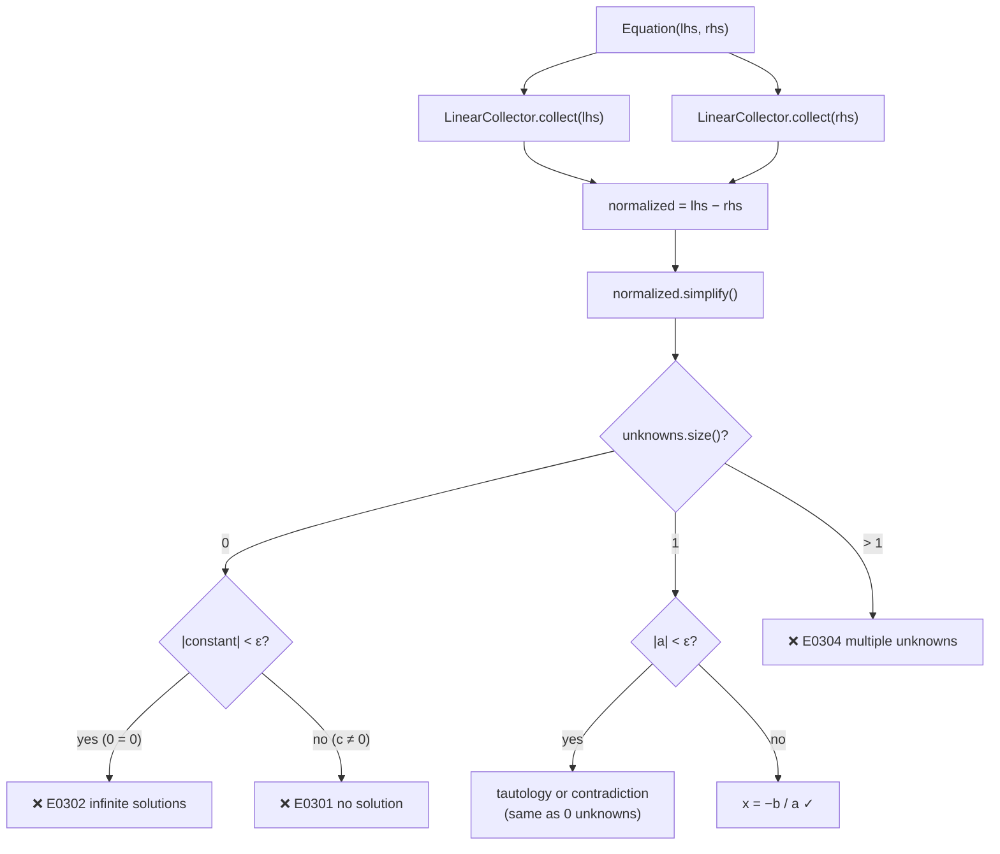
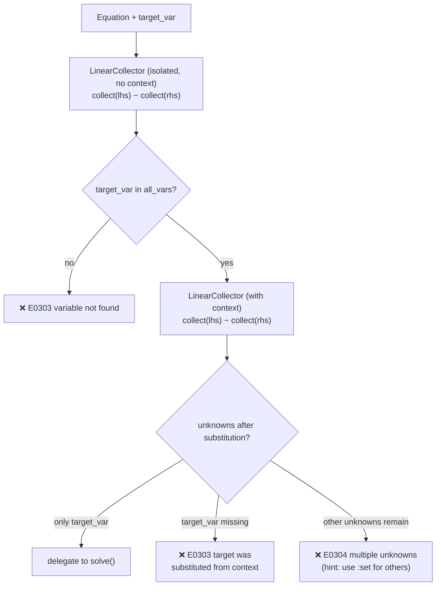

# Linear Equation Solver

> **Sources:** `src/algebra/solver/solver.hpp`, `src/algebra/solver/solver.cpp`
>
> Solves single-variable linear equations of the form $ax + b = 0$.

---

## Overview

`EquationSolver` accepts an `Equation` AST node, reduces it to a `LinearForm` via `LinearCollector`, and solves for the unique unknown using exact arithmetic: $x = -b/a$.

For polynomial (non-linear) equations, use `PolynomialSolver` instead. For multi-variable systems, use `MatrixSolver`.

---

## SolveResult

Holds the result of solving a single equation.

```cpp
struct SolveResult {
    std::string variable;       // name of the solved variable
    double      value;          // numeric value of the solution
    bool        has_solution;   // true iff a unique solution was found
};
```

### `to_string()`

- When `has_solution == true`: `"variable = value"` with trailing zeros stripped
  - `6.000000` → `"x = 6"`
  - `3.500000` → `"x = 3.5"`
- When `has_solution == false`: `"no solution"`

---

## EquationSolver

### State

```cpp
class EquationSolver {
    const Context* context_;    // variable bindings for substitution (nullable)
    std::string    input_;      // raw source text for diagnostics
};
```

### Constructors

```cpp
EquationSolver();                                                // no context
EquationSolver(const Context* ctx);                              // with context
EquationSolver(const Context* ctx, const std::string& input);    // full
```

---

## `solve(equation)` — Main Solver

```cpp
Result<SolveResult> solve(const Equation& eq);
```

### Dataflow



### Algorithm Step-by-Step

**Step 1 — Normalize to $\text{LHS} - \text{RHS} = 0$:**

```cpp
LinearCollector collector(context_, input_, false);
LinearForm lhs = collector.collect(eq.lhs());
LinearForm rhs = collector.collect(eq.rhs());
LinearForm normalized = lhs - rhs;
normalized.simplify();
```

If either side fails to collect (non-linear), the error is propagated immediately.

**Step 2 — Count unknowns:**

```cpp
std::set<std::string> unknowns = normalized.variables();
```

**Step 3 — Branch on unknown count:**

| `unknowns.size()` | Behaviour                                                                                                                                               |
| ----------------- | ------------------------------------------------------------------------------------------------------------------------------------------------------- |
| **0**             | Equation reduced to a constant. If $\text{constant}  < \epsilon$ → `E0302` (infinite solutions: $0 = 0$). Otherwise → `E0301` (no solution: $c \ne 0$). |
| **1**             | Exactly one unknown. Extract coefficient $a$ and constant $b$.                                                                                          |
| **> 1**           | Multiple unknowns after substitution → `E0304` (multiple unknowns). Lists all remaining variables.                                                      |

**Step 4 — Solve (single unknown):**

```cpp
double a = normalized.get_coeff(var);
double b = normalized.constant;
```

**Degenerate check:** If $|a| < \epsilon$, the variable was algebraically eliminated:
- $|b| < \epsilon$ → $0 \cdot x = 0$ → `E0302` (infinite solutions)
- $|b| \ge \epsilon$ → $0 \cdot x = c$ → `E0301` (no solution)

**Solution:**
$$x = \frac{-b}{a}$$

Returns `SolveResult { variable = var, value = -b/a, has_solution = true }`.

---

## `solve_for(equation, target_var)` — Targeted Solver

```cpp
Result<SolveResult> solve_for(const Equation& eq, const std::string& target_var);
```

Solves for a **specific** variable. This is used when the user explicitly specifies which variable to solve for (e.g. via `:solve` with a designated target).

### Algorithm



**Step 1 — Pre-check (without context):**

Uses an **isolated** `LinearCollector` (no context substitution) to verify `target_var` actually appears in the equation. This prevents misleading errors when a variable was never present.

**Step 2 — Context substitution:**

Uses a normal `LinearCollector` (with context) to substitute known variables. This may:
- Eliminate all variables except the target → proceeds to solve
- Eliminate the target itself → error (variable was already defined in context)
- Leave other unknowns → error (multiple unknowns, with hint to use `:set`)

**Step 3 — Delegation:**

If only the target variable remains, delegates to `solve()` for the actual computation.

---

## Error Codes

| Code  | Factory                | Trigger                                                            | Help Text                                       |
| ----- | ---------------------- | ------------------------------------------------------------------ | ----------------------------------------------- |
| E0301 | `no_solution()`        | Constant ≠ 0 after normalization                                   | —                                               |
| E0302 | `infinite_solutions()` | Constant ≈ 0 after normalization                                   | —                                               |
| E0303 | `invalid_equation()`   | Target variable not in equation; or target was context-substituted | —                                               |
| E0304 | `multiple_unknowns()`  | > 1 unknown after substitution                                     | "provide values for other variables using :set" |

---

## Examples

| Input         | Context   | Result                                    |
| ------------- | --------- | ----------------------------------------- |
| `x + 3 = 7`   | —         | `x = 4`                                   |
| `2*x - 6 = 0` | —         | `x = 3`                                   |
| `a + x = 10`  | `{a = 3}` | `x = 7` (a substituted)                   |
| `x = x`       | —         | `E0302` — infinite solutions              |
| `1 = 2`       | —         | `E0301` — no solution                     |
| `x + y = 5`   | —         | `E0304` — multiple unknowns: x, y         |
| `x^2 = 4`     | —         | Error from `LinearCollector` — non-linear |

---

## Further Reading

- [Linear Collector](linear-collector.md) — How equations are reduced to `LinearForm`
- [Polynomial Solver](poly-solver.md) — Handles non-linear equations (`x^2`, cubics, etc.)
- [Matrix Solver](matrix-solver.md) — Handles multiple-unknown systems
- [Simplify](simplify.md) — Canonicalizes equations without solving them
