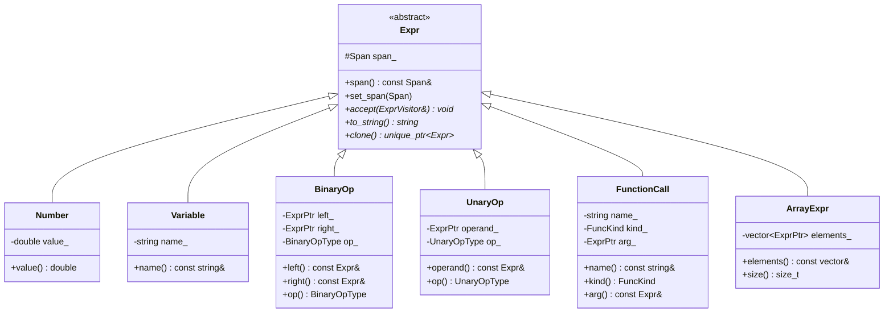
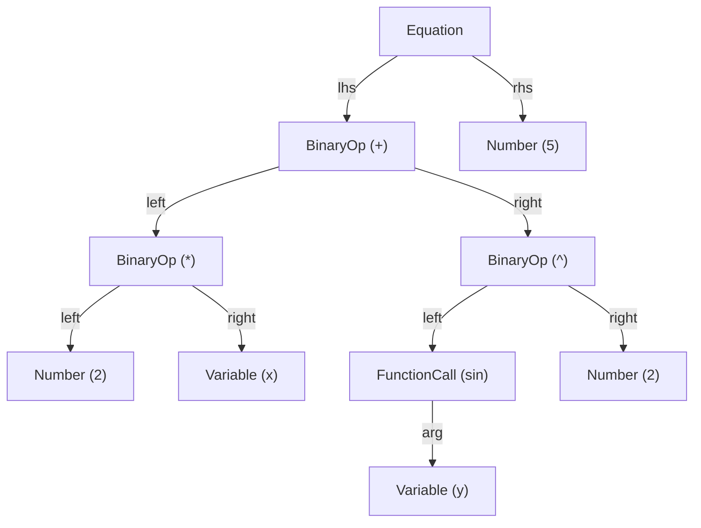
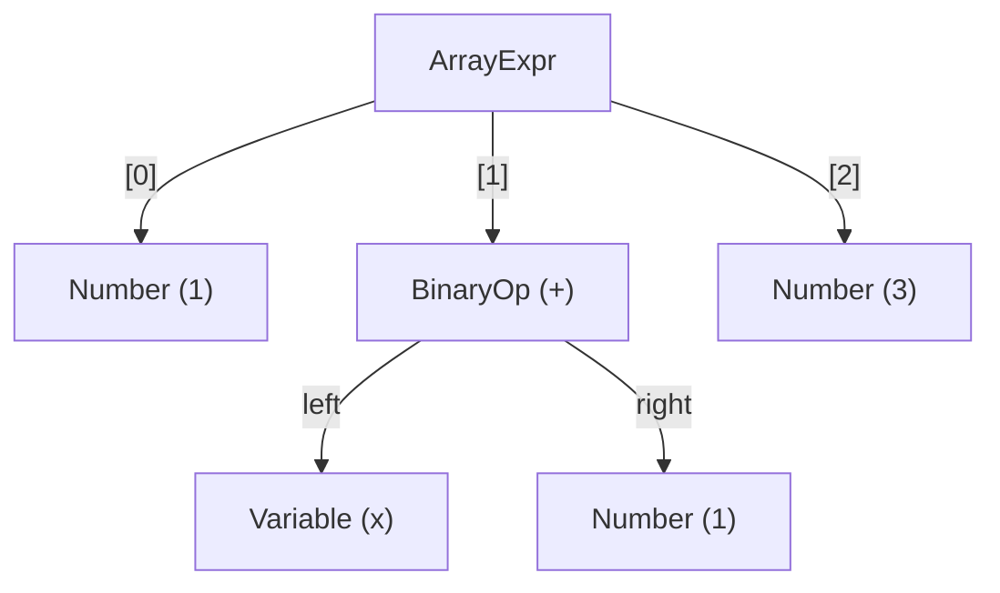
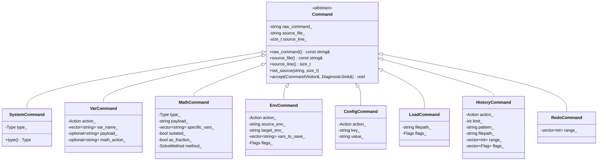
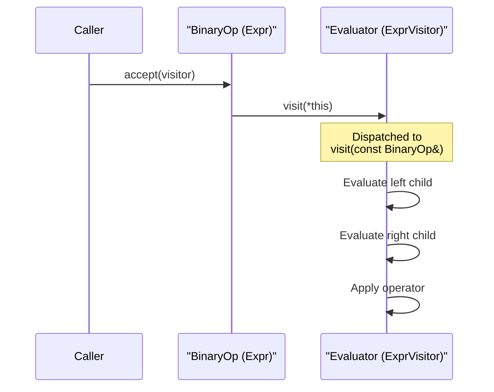
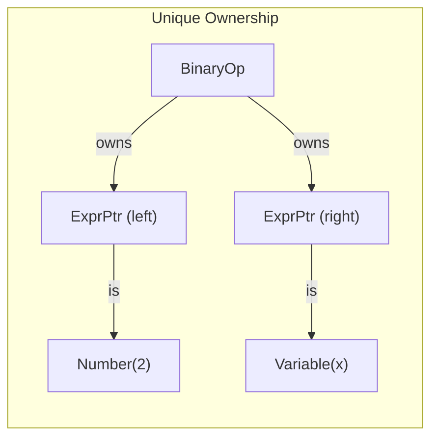

# Abstract Syntax Tree (AST)

> **Audience:** Developers who need to understand the AST node hierarchies, ownership model, and visitor pattern used throughout cmath-solver.

## Overview

cmath-solver has two parallel AST families:

1. **Math AST** — Represents mathematical expressions (`2*x + sin(y)`)
2. **Command AST** — Represents REPL commands (`:solve`, `:set`, `:env`, …)

Both use the **Visitor pattern** for dispatch. The `Equation` type bridges the two families—it's parsed from math input but often appears inside command payloads.

---

## Math Expression Hierarchy



### Node Types

| Node           | Kind     | Fields                      | Example     |
| -------------- | -------- | --------------------------- | ----------- |
| `Number`       | Leaf     | `double value_`             | `3.14`      |
| `Variable`     | Leaf     | `string name_`              | `x`         |
| `BinaryOp`     | Interior | `left_`, `right_`, `op_`    | `(x + 2)`   |
| `UnaryOp`      | Interior | `operand_`, `op_`           | `(-x)`      |
| `FunctionCall` | Interior | `name_`, `kind_`, `arg_`    | `sin(x)`    |
| `ArrayExpr`    | Compound | `vector<ExprPtr> elements_` | `[1, 2, 3]` |

### Binary Operators

```cpp
enum class BinaryOpType { Add, Sub, Mul, Div, Pow };
```

### Unary Operators

```cpp
enum class UnaryOpType { Neg };  // Only negation currently
```

### Function Kinds

```cpp
enum class FuncKind {
    Sin, Cos, Tan,           // Trigonometric
    Asin, Acos, Atan,        // Inverse trigonometric
    Sinh, Cosh, Tanh,        // Hyperbolic
    Exp, Sqrt, Ln, Log,      // Exponential / logarithmic
    Abs, Floor, Ceil, Round   // Rounding / absolute
};
```

Functions are resolved at parse time via `func_kind_from_name()` — a static `unordered_map` lookup. This means evaluation only needs a switch on the enum, not runtime string matching.

### Equation (Separate Type)

`Equation` is **not** an `Expr` subclass. It's a top-level construct:

```cpp
class Equation {
    ExprPtr lhs_;  // Left-hand side expression
    ExprPtr rhs_;  // Right-hand side expression
};
```

The parser returns `Result<pair<ExprPtr, EquationPtr>>` — exactly one of the two is populated.

---

## AST Tree Example

The expression `2*x + sin(y)^2 = 5` produces:



The expression `[1, x+1, 3]` (array literal) produces:



---

## Command Hierarchy



### Command Types Summary

| Command          | Actions / Types                                                 | Example                         |
| ---------------- | --------------------------------------------------------------- | ------------------------------- |
| `SystemCommand`  | `Exit`, `Help`, `Clear`, `Ls`                                   | `:help`                         |
| `VarCommand`     | `Set`, `Unset`                                                  | `:set x 2*pi`                   |
| `MathCommand`    | `Evaluate`, `Solve`, `Simplify`, `Expand`, `Factor`             | `:solve 2x+3=7`                 |
| `EnvCommand`     | `Show`, `List`, `Load`, `Save`, `New`, `Delete`, `Move`, `Copy` | `:env load workspace1`          |
| `ConfigCommand`  | `List`, `Get`, `Set`, `Path`, `Reset`                           | `:config set output.decimals 4` |
| `LoadCommand`    | *(single action)*                                               | `:load script.msl`              |
| `HistoryCommand` | `Show`, `ShowRange`, `Search`, `Save`, `Clear`                  | `:history search solve`         |
| `RedoCommand`    | *(single action)*                                               | `:redo 3`                       |

---

## Visitor Pattern

### Double-Dispatch Mechanism

The visitor pattern uses double-dispatch: each AST node's `accept()` calls the correct `visit()` overload on the visitor, resolved at compile time.



### ExprVisitor Interface

All math semantic passes implement this interface:

```cpp
class ExprVisitor {
public:
    virtual void visit(const Number& node) = 0;
    virtual void visit(const BinaryOp& node) = 0;
    virtual void visit(const UnaryOp& node) = 0;
    virtual void visit(const Variable& node) = 0;
    virtual void visit(const ArrayExpr& node) = 0;
    virtual void visit(const FunctionCall& node) = 0;
};
```

**Implementations:** `Evaluator`, `Resolver`, `LinearCollector`, `AstToPoly`, `Expander`

> **Design rule:** All visit methods are pure virtual. When you add a new `Expr` subclass, the compiler forces every visitor to handle it.

### CommandVisitor Interface

```cpp
class CommandVisitor {
public:
    virtual void visit(const SystemCommand& cmd, DiagnosticSink& sink) = 0;
    virtual void visit(const VarCommand& cmd, DiagnosticSink& sink) = 0;
    virtual void visit(const MathCommand& cmd, DiagnosticSink& sink) = 0;
    virtual void visit(const EnvCommand& cmd, DiagnosticSink& sink) = 0;
    virtual void visit(const ConfigCommand& cmd, DiagnosticSink& sink) = 0;
    virtual void visit(const LoadCommand& cmd, DiagnosticSink& sink) = 0;
    virtual void visit(const HistoryCommand& cmd, DiagnosticSink& sink) = 0;
    virtual void visit(const RedoCommand& cmd, DiagnosticSink& sink) = 0;
};
```

Note the `DiagnosticSink&` parameter — command visitors report errors through the sink rather than returning `Result<T>`.

**Implementation:** `HandlerRegistry`

---

## Ownership Model



| Rule                         | Detail                                                           |
| ---------------------------- | ---------------------------------------------------------------- |
| `ExprPtr = unique_ptr<Expr>` | Every node has exactly one owner                                 |
| No aliasing                  | Two pointers never refer to the same node                        |
| Deep clone via `clone()`     | Returns a new `unique_ptr` with recursively cloned children      |
| Move semantics               | Nodes are moved during construction, never copied implicitly     |
| Immutable after construction | AST is read-only; mutations create new trees via clone + rewrite |

### Clone Example

```cpp
// Deep-copy an entire subtree
ExprPtr original = make_unique<BinaryOp>(
    make_unique<Number>(2), make_unique<Variable>("x"), BinaryOpType::Mul);

ExprPtr copy = original->clone();  // Independent copy
```

---

## Span Tracking

Every node carries a `Span{start, end}` (byte offsets into the source string).

```
Input:  2*x + sin(y)
Spans:  ^^^ ─ BinaryOp(Mul) [0,3)
        ^^^^^^^^^^^^─ BinaryOp(Add) [0,12)
              ^^^^^^─ FunctionCall(sin) [6,12)
```

`BinaryOp` computes its span as `left.span().merge(right.span())` — the minimum interval covering both children. `set_span()` can override this for parenthesized expressions.

---

## File Locations

| File                                  | Contains                                            |
| ------------------------------------- | --------------------------------------------------- |
| `src/ast/math/expr.hpp`               | `Expr` base class, `ExprPtr` typedef                |
| `src/ast/math/expr_visitor.hpp`       | `ExprVisitor` interface                             |
| `src/ast/math/number_expr.hpp`        | `Number`                                            |
| `src/ast/math/variable_expr.hpp`      | `Variable`                                          |
| `src/ast/math/binary_expr.hpp`        | `BinaryOp`, `BinaryOpType`                          |
| `src/ast/math/unary_expr.hpp`         | `UnaryOp`, `UnaryOpType`                            |
| `src/ast/math/call_expr.hpp`          | `FunctionCall`, `FuncKind`, `func_kind_from_name()` |
| `src/ast/math/array_expr.hpp`         | `ArrayExpr`                                         |
| `src/ast/math/equation_expr.hpp`      | `Equation`, `EquationPtr`                           |
| `src/ast/command/command.hpp`         | `Command` base class, `CommandPtr`                  |
| `src/ast/command/command_visitor.hpp` | `CommandVisitor` interface                          |
| `src/ast/command/*.hpp`               | Individual command AST nodes                        |

---

## Further Reading

- [Parser](parser.md) — How source text becomes AST nodes
- [Evaluation](evaluation.md) — How AST nodes are evaluated
- [Adding an AST Node](../contributing/adding-an-ast-node.md) — Step-by-step guide
