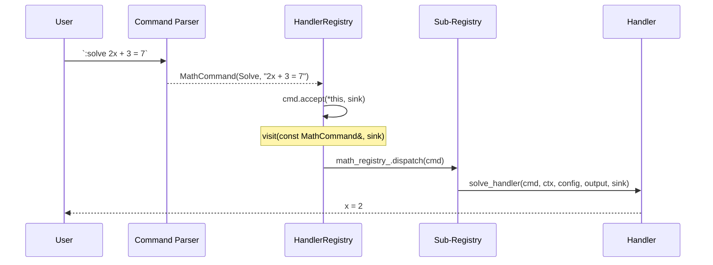
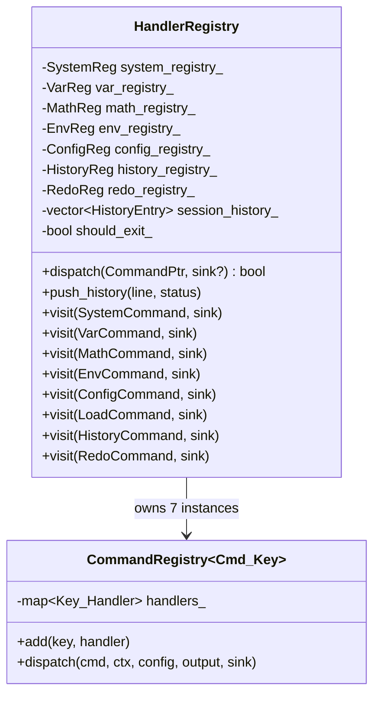
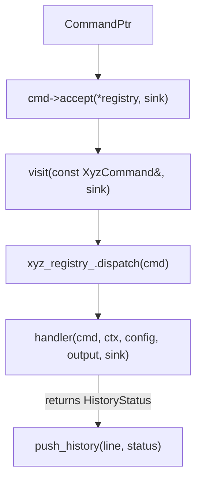

# Command System

> **Audience:** Developers who need to understand how commands are dispatched, what each handler does, and how the REPL integrates.

## Overview

The command system uses a **registry-based double-dispatch** pattern:



---

## HandlerRegistry

**Files:** `src/commands/registry.hpp`, `src/commands/registry.cpp`

### Architecture

`HandlerRegistry` implements `CommandVisitor`. It owns 7 sub-registries, one per command family:



### Generic CommandRegistry

```cpp
template <typename Cmd, typename Key>
class CommandRegistry {
    using Handler = std::function<HistoryStatus(
        const Cmd&, Context&, Config&, std::string&, DiagnosticSink&)>;

    std::unordered_map<Key, Handler> handlers_;
};
```

Each handler receives the command AST node, mutable context, mutable config, an output string reference, and a diagnostic sink. It returns a `HistoryStatus`.

### HistoryStatus

```cpp
enum class HistoryStatus { Success, Warning, Error, Info, Unknown };
```

This status is stored in the session history for filtering (`:history --errors`).

### Dispatch Flow



---

## Handler Details

### System Handler

**File:** `src/commands/handlers/system_handler.hpp`

| Action    | Command                | Behavior                                           |
| --------- | ---------------------- | -------------------------------------------------- |
| `Exit`    | `:exit`, `:quit`, `:q` | Sets `should_exit_` flag → REPL loop terminates    |
| `Help`    | `:help`, `:h`          | Prints formatted help menu with all commands       |
| `Clear`   | `:clear`, `:cls`       | Emits ANSI escape to clear terminal                |
| `Ls`      | `:ls`                  | Lists all context variables in aligned columns     |
| `Unknown` | `:xyz`                 | Emits `unknown_command` diagnostic with suggestion |

### Variable Handler

**File:** `src/commands/handlers/var_handler.hpp`

| Action         | Command                 | Behavior                                        |
| -------------- | ----------------------- | ----------------------------------------------- |
| `Set`          | `:set x 2*pi`           | Parse expression, store symbolic `ExprPtr`      |
| `Set + solve`  | `:set x solve 2x+3=7`   | Solve equation (isolated context), store result |
| `Set + expand` | `:set x expand (a+b)^2` | Expand polynomial, store result                 |
| `Set + factor` | `:set x factor x^2-1`   | Factor polynomial, store result                 |
| `Unset`        | `:unset x` or `:rm x`   | Remove variable from context                    |

**Validation:**
- Variable name must be a valid identifier (starts with letter/underscore)
- Reserved keywords rejected
- Multiple variable names rejected for `:set`
- Attempts eager evaluation via Resolver; warns on circular dependency

### Math Handler

**File:** `src/commands/handlers/math_handler.hpp`

| Type             | Command                 | Behavior                                        |
| ---------------- | ----------------------- | ----------------------------------------------- |
| `Evaluate`       | `2 + 3` or `:eval 2+3`  | Direct numeric evaluation                       |
| `Solve`          | `:solve 2x+3=7`         | Linear equation solver (single variable)        |
| `Solve` (system) | `:solve "x+y=1; x-y=3"` | Matrix solver (Gauss/LU) for multiple equations |
| `Simplify`       | `:simplify 3x+2x-1=0`   | Canonical form: `5x = 1`                        |
| `Expand`         | `:expand (x+1)^2`       | Polynomial expansion                            |
| `Factor`         | `:factor x^2-1`         | Polynomial factorization                        |

**Solve Flags:**

| Flag                | Effect                                              |
| ------------------- | --------------------------------------------------- |
| `--no-save`         | Don't store solution variables in context           |
| `--method=gauss`    | Use Gaussian elimination (default)                  |
| `--method=lu`       | Use LU decomposition                                |
| `--show-matrix`     | Display augmented matrix                            |
| `--rank`            | Display matrix rank                                 |
| `--detect-singular` | Warn on near-singular matrices                      |
| `--free-vars`       | Show parameterized form for underdetermined systems |
| `--vars x y`        | Restrict to specific variables                      |
| `--isolated`        | Evaluate without context variables                  |
| `--fraction`        | Display results as fractions                        |

### Environment Handler

**File:** `src/commands/handlers/env_handler.hpp`

| Action        | Command                       | Behavior                                         |
| ------------- | ----------------------------- | ------------------------------------------------ |
| `List`        | `:env list`                   | Lists all environments, marks active with `*`    |
| `Show`        | `:env show`                   | Prints current environment name                  |
| `Load`        | `:env load ws1`               | Saves current context → loads target from config |
| `Save`        | `:env save [name]`            | Persists context to environment                  |
| `Save --vars` | `:env save --vars x y`        | Saves only specified variables                   |
| `New`         | `:env new ws2`                | Creates empty environment                        |
| `Delete`      | `:env delete ws2`             | Removes environment (protects active)            |
| `Move`        | `:env mv src dst`             | Rename environment                               |
| `Move --vars` | `:env mv --vars x y --to ws2` | Move variables between environments              |
| `Copy`        | `:env cp src dst`             | Copy environment                                 |
| `Copy --vars` | `:env cp --vars x y --to ws2` | Copy variables between environments              |

### Config Handler

**File:** `src/commands/handlers/config_handler.hpp`

| Action  | Command                         | Behavior                         |
| ------- | ------------------------------- | -------------------------------- |
| `List`  | `:config list`                  | Aligned table of all settings    |
| `Get`   | `:config get output.decimals`   | Show single setting value        |
| `Set`   | `:config set output.decimals 4` | Validate, apply, persist to JSON |
| `Path`  | `:config path`                  | Show config file path            |
| `Reset` | `:config reset`                 | Restore all defaults, persist    |

**Special:** Setting `auto_load_env` validates the environment exists.

### History Handler

**File:** `src/commands/handlers/history_handler.hpp`

| Action          | Command                          | Behavior                            |
| --------------- | -------------------------------- | ----------------------------------- |
| `Show`          | `:history [n]`                   | Show last $n$ commands (default 20) |
| `Show all`      | `:history all`                   | Show entire session history         |
| `Search`        | `:history search solve`          | Filter by substring match           |
| `Save`          | `:history save file.msl`         | Export as `.msl` script             |
| `Save filtered` | `:history save file.msl 1,3,5-8` | Export specific entries             |
| `Clear`         | `:history clear`                 | Wipe in-memory and on-disk history  |

**Flags:** `--errors`, `--success`, `--warning`, `--info` filter by status.

**Persistence:** Commands are appended to `~/.config/cmath-solver/history.txt` in two-line format:
```
2026-03-09T10:30:00 [Success]
:solve 2x + 3 = 7
```

### Load Handler

**File:** `src/commands/handlers/load_handler.hpp`

| Command                          | Behavior                                  |
| -------------------------------- | ----------------------------------------- |
| `:load script.msl`               | Execute script via `Runner::run_script()` |
| `:load script.msl --dry-run`     | Parse only, don't execute                 |
| `:load script.msl --silent`      | Suppress output                           |
| `:load script.msl --strict`      | Stop on first error                       |
| `:load script.msl --env ws1`     | Execute in named environment              |
| `:load script.msl --no-rollback` | Don't undo on errors                      |

### Redo Handler

**File:** `src/commands/handlers/redo_handler.hpp`

| Command         | Behavior                     |
| --------------- | ---------------------------- |
| `:redo`         | Re-execute last command      |
| `:redo 3`       | Re-execute command #3        |
| `:redo 1,3,5-8` | Re-execute commands by range |

Commands are echoed with `>> ` prefix before re-dispatch.

---

## Session History

The `HandlerRegistry` maintains an in-memory `vector<HistoryEntry>`:

```cpp
struct HistoryEntry {
    std::string command;      // Raw input line
    HistoryStatus status;     // Success/Warning/Error/Info
    std::string timestamp;    // ISO 8601
};
```

**Deduplication:** Controlled by `settings.history_dedup` — consecutive duplicates are suppressed.

**Disk persistence:** Written to `~/.config/cmath-solver/history.txt` (or platform equivalent).

---

## REPL Integration

### Completions

**File:** `src/ui/repl/completions.hpp`

Tab-completion provides:
- Command names (`:solve`, `:set`, `:env`, …)
- Subcommand names (`:env list`, `:config get`, …)
- Variable names from context
- Math function names (`sin`, `cos`, `sqrt`, …)
- Setting keys (`output.decimals`, `solver.tolerance`, …)

### Syntax Highlighting

**File:** `src/ui/repl/highlighter.hpp`

Replxx callback colorizes input in real-time:
- Commands (`:solve`) — bold/highlighted
- Numbers — distinct color
- Operators — distinct color
- Functions — distinct color

### Hints

**File:** `src/ui/repl/hints.hpp`

Shows partially-transparent completions as the user types. Suggests the most likely completion based on prefix matching.

### History Navigation

**File:** `src/ui/repl/history.hpp`

Up/down arrows navigate through replxx history (in-memory + file-backed).

---

## File Locations

| File                                | Contains                                              |
| ----------------------------------- | ----------------------------------------------------- |
| `src/commands/registry.hpp`         | `HandlerRegistry`, `CommandRegistry<Cmd,Key>`         |
| `src/commands/registry.cpp`         | `build_handler_registry()`, all handler registrations |
| `src/commands/handlers/*.hpp`       | Individual handler implementations                    |
| `src/ast/command/history_entry.hpp` | `HistoryEntry` struct                                 |
| `src/ui/repl/repl.hpp`              | `run_repl()` entry point                              |
| `src/ui/repl/repl.cpp`              | REPL initialization and session loop                  |
| `src/ui/repl/completions.hpp`       | Tab-completion callback                               |
| `src/ui/repl/highlighter.hpp`       | Syntax highlighting callback                          |
| `src/ui/repl/hints.hpp`             | Hint callback                                         |
| `src/ui/repl/history.hpp`           | History management                                    |
| `src/ui/repl/runner.hpp`            | `Runner` class                                        |
| `src/ui/repl/runner.cpp`            | Interactive loop + script executor                    |

---

## Further Reading

- [AST](ast.md) — Command node types dispatched here
- [Diagnostics](diagnostics.md) — Error reporting from handlers
- [Adding a Command](../contributing/adding-a-command.md) — Step-by-step guide
