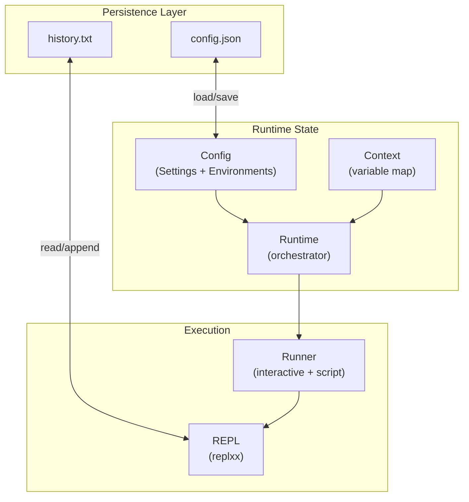
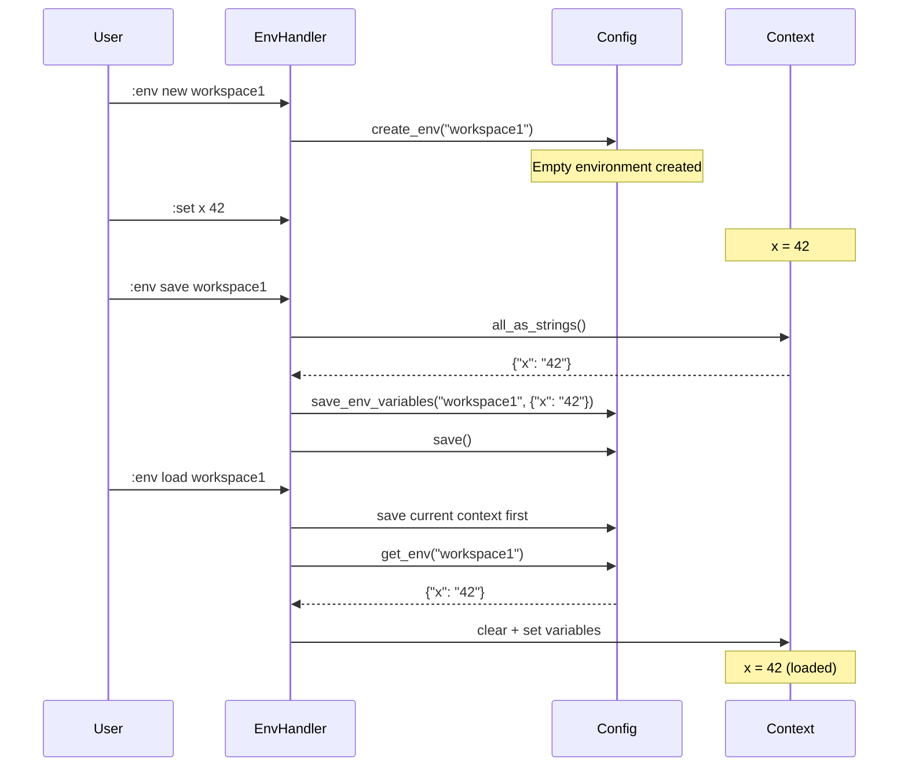
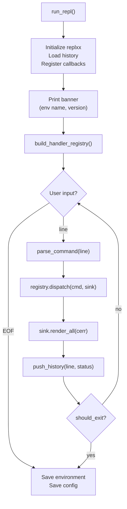

# Config & Runtime

> **Audience:** Developers who need to understand how cmath-solver manages state, configuration, environments, and the REPL/script execution lifecycle.

## Overview



---

## Context

**Files:** `src/runtime/context/context.hpp`, `src/runtime/context/context.cpp`

`Context` is the variable storage — an `unordered_map<string, ExprPtr>` with value semantics.

### API

| Method              | Description                                         |
| ------------------- | --------------------------------------------------- |
| `set(name, expr)`   | Insert or overwrite binding (clones the expression) |
| `set(name, double)` | Convenience: wraps value in `Number` node           |
| `get_expr(name)`    | Returns `const Expr&` (panics if absent)            |
| `has(name)`         | Existence check — $O(1)$                            |
| `unset(name)`       | Remove binding, returns `bool`                      |
| `clear()`           | Wipe all bindings                                   |
| `all_names()`       | Returns `vector<string>` of all variable names      |
| `all_as_strings()`  | Returns `map<string, string>` for serialization     |
| `size()`            | Number of bindings                                  |

### Copy Semantics

```
Context a;
a.set("x", 42);
Context b = a;  // Full deep clone — b owns independent ExprPtr copies
```

Deep clone on copy ensures no shared pointers between contexts. This is critical for snapshot/restore.

### Invariants

- Every variable name is unique
- All `ExprPtr` values are non-null
- Variable names are case-sensitive

---

## Config

**Files:** `src/config/config.hpp`, `src/config/config.cpp`

Manages two concerns:

1. **Settings** — Application preferences
2. **Environments** — Named variable workspaces

### Persistence

Config is stored as JSON:

| Platform     | Path                                 |
| ------------ | ------------------------------------ |
| **Linux**    | `~/.config/cmath-solver/config.json` |
| **Windows**  | `%APPDATA%\cmath-solver\config.json` |
| **Fallback** | `.cmath_solver_config.json` in CWD   |

### Config API

| Method                          | Description                                                  |
| ------------------------------- | ------------------------------------------------------------ |
| `load()`                        | Read JSON; migrate legacy format; create defaults if missing |
| `save()`                        | Write current state to JSON                                  |
| `settings`                      | Direct access to `Settings` struct (read/write)              |
| `env_exists(name)`              | Check if environment exists                                  |
| `get_env(name)`                 | Get environment (mutable/const)                              |
| `create_env(name)`              | Create empty environment                                     |
| `delete_env(name)`              | Remove environment                                           |
| `list_envs()`                   | Sorted list of all environment names                         |
| `rename_env(src, dst)`          | Rename an environment                                        |
| `copy_env(src, dst)`            | Deep-copy an environment                                     |
| `save_env_variables(name, map)` | Overwrite all variables in environment                       |

---

## Settings

**File:** `src/config/settings.hpp`

See [Settings Reference](../reference/settings.md) for the complete table.

### Categories

| Category    | Keys                                                    | Purpose                     |
| ----------- | ------------------------------------------------------- | --------------------------- |
| `output.*`  | mode, decimals, fraction, trailing_zeros, thousands_sep | Output formatting           |
| `solver.*`  | tolerance, coeff_tol, pivot_tol, max_iter               | Numerical solver parameters |
| `history.*` | size, dedup, ignore                                     | History management          |
| `repl.*`    | prompt, show_timing, auto_save_env, confirm_delete      | REPL behavior               |
| *(global)*  | auto_load_env                                           | Startup environment         |

### Tolerance Propagation

When tolerance settings change, `Settings::apply_to_globals()` propagates values to the mutable globals in `core/tolerance.hpp`:

```
settings.solver_tolerance  →  kEpsilon
settings.solver_coeff_tol  →  kCoeffTol
settings.solver_pivot_tol  →  kPivotTol
```

This is called after `load()`, `set()`, and `reset()`.

---

## Environments

**File:** `src/config/environment.hpp`

An environment is a named map of `string → string` (serialized variable expressions):

```cpp
struct Environment {
    std::string name;
    std::unordered_map<std::string, std::string> variables;
};
```

### Lifecycle



### Serialization

Variables are stored as strings in JSON:

```json
{
  "environments": {
    "workspace1": {
      "variables": {
        "x": "42",
        "expr": "2*x + 1"
      }
    }
  }
}
```

On load, expression strings are parsed back to `ExprPtr` via the math parser. Legacy numeric strings fall back to `std::stod()`.

### Startup

The `auto_load_env` setting (default: `""`) specifies which environment to load at REPL startup. If the environment doesn't exist, `"default"` is used.

---

## Runtime

**Files:** `src/runtime/runtime.hpp`, `src/runtime/runtime.cpp`

`Runtime` is the top-level state orchestrator. It holds references to `Context`, `Config`, and the current environment name.

### Key Methods

| Method                   | Description                                      |
| ------------------------ | ------------------------------------------------ |
| `evaluate(expr)`         | Delegates to Resolver                            |
| `save_environment()`     | Persist context to Config under current env name |
| `load_environment(name)` | Load variables from Config into Context          |
| `snapshot()`             | Capture full state (for rollback)                |
| `restore(snapshot)`      | Restore previously captured state                |

### Snapshot / Restore

Used by script execution to enable rollback on errors:

```cpp
auto snap = runtime.snapshot();  // Deep-copies Context + env name
try_run_script();
if (had_errors && !no_rollback) {
    runtime.restore(snap);       // Undo everything
}
```

---

## REPL Lifecycle

**Files:** `src/ui/repl/repl.hpp`, `src/ui/repl/repl.cpp`



### Replxx Callbacks

| Callback    | File                          | Purpose                                                     |
| ----------- | ----------------------------- | ----------------------------------------------------------- |
| Completions | `src/ui/repl/completions.hpp` | Tab-completion for commands, variables, functions, settings |
| Highlighter | `src/ui/repl/highlighter.hpp` | Real-time syntax coloring                                   |
| Hints       | `src/ui/repl/hints.hpp`       | Ghost-text completion suggestions                           |

### Prompt Format

```
[default] > _
```

- `[env_name]` in bold
- `> ` as the prompt character (configurable via `repl.prompt`)

---

## Runner

**Files:** `src/ui/repl/runner.hpp`, `src/ui/repl/runner.cpp`

The `Runner` drives both interactive and script execution.

### Interactive Mode

```
run_interactive():
  loop:
    line = rx.input(prompt)
    if empty or comment → skip
    run_line(line)     → parse + dispatch
    push_history(line) → persist to replxx + disk
    if should_exit → break
```

**Error resilience:** Exceptions are caught and reported — the REPL remains live.

### Script Mode

```
run_script(filepath, flags):
  open file
  snapshot = runtime.snapshot()       // For rollback
  if flags.env → switch environment
  for each line:
    skip comments (#) and empty lines
    if flags.silent → suppress stdout
    parse_command(line)
    dispatch(cmd, sink)
    if error and flags.strict → break
  if errors and !flags.no_rollback:
    runtime.restore(snapshot)          // Undo all changes
  print summary (errors, warnings)
```

### Script Comments

Lines starting with `#` are treated as comments and skipped:

```msl
# This is a comment
:set x 42
:solve 2x + 3 = 7  # Inline comments also stripped
```

---

## Platform-Specific Paths

| Resource         | Linux                                | Windows                              |
| ---------------- | ------------------------------------ | ------------------------------------ |
| Config           | `~/.config/cmath-solver/config.json` | `%APPDATA%\cmath-solver\config.json` |
| History          | `~/.config/cmath-solver/history.txt` | `%APPDATA%\cmath-solver\history.txt` |
| Fallback config  | `.cmath_solver_config.json`          | `.cmath_solver_config.json`          |
| Fallback history | `.cmath_solver_history`              | `.cmath_solver_history`              |

Path resolution is in `src/utils/path_utils.hpp` and `src/config/config.cpp`.

---

## File Locations

| File                               | Contains                          |
| ---------------------------------- | --------------------------------- |
| `src/runtime/context/context.hpp`  | `Context` class                   |
| `src/runtime/context/context.cpp`  | Context implementation            |
| `src/runtime/context/resolver.hpp` | `Resolver` class                  |
| `src/runtime/context/resolver.cpp` | Lazy resolution + cycle detection |
| `src/runtime/runtime.hpp`          | `Runtime` orchestrator            |
| `src/runtime/runtime.cpp`          | Runtime implementation            |
| `src/config/config.hpp`            | `Config` class                    |
| `src/config/config.cpp`            | JSON persistence                  |
| `src/config/settings.hpp`          | `Settings` struct                 |
| `src/config/environment.hpp`       | `Environment` struct              |
| `src/ui/repl/repl.hpp`             | `run_repl()`                      |
| `src/ui/repl/repl.cpp`             | REPL initialization               |
| `src/ui/repl/runner.hpp`           | `Runner` class                    |
| `src/ui/repl/runner.cpp`           | Interactive + script execution    |
| `src/ui/color.hpp`                 | ANSI color constants              |
| `src/utils/path_utils.hpp`         | Platform-specific path resolution |

---

## Further Reading

- [Architecture Overview](overview.md) — Where config/runtime sit in the pipeline
- [Commands](commands.md) — How handlers interact with context and config
- [Settings Reference](../reference/settings.md) — Complete settings table
