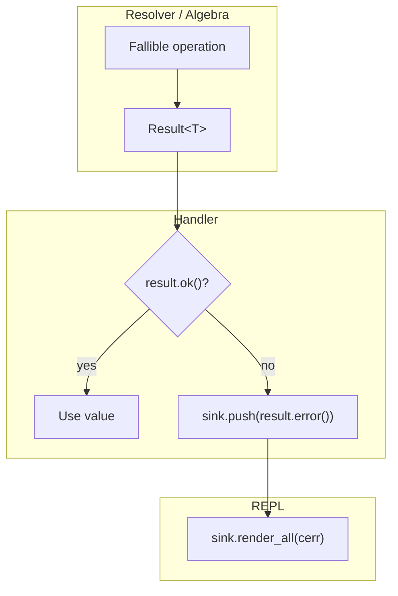

# Diagnostics & Error Handling

> **Audience:** Developers who need to understand how errors are represented, propagated, and rendered in cmath-solver.

## Design Philosophy

cmath-solver uses **no exceptions for user errors**. All fallible operations return `Result<T>` — a variant that holds either a success value or a `Diagnostic`. Exceptions are reserved exclusively for programmer bugs (assertions / unreachable code).

---

## Result\<T\>

**File:** `src/diagnostics/result.hpp`

`Result<T>` is a `std::variant<T, Diagnostic>` with a monadic API:

```cpp
template <typename T>
class Result {
    std::variant<T, Diagnostic> data_;

public:
    // Construction
    static Result ok(T value);
    static Result err(Diagnostic diag);

    // Status
    bool ok() const;
    bool failed() const;

    // Access (asserts on wrong state)
    T& operator*();
    const T& operator*() const;
    T* operator->();
    Diagnostic& error();
    const Diagnostic& error() const;

    // Chaining
    template <typename F>
    auto map(F&& f) -> Result<decltype(f(std::declval<T>()))>;

    template <typename F>
    Result map_error(F&& f);

    Result with_location(const std::string& file, size_t line) &&;
};
```

### Usage Pattern

```cpp
Result<double> result = resolver.evaluate(expr, ctx);
if (result.failed()) {
    sink.push(result.error());
    return;
}
double value = *result;
```

### MultiResult\<T\>

For operations that can partially succeed (e.g., parsing multiple equations):

```cpp
template <typename T>
struct MultiResult {
    std::optional<T> value;
    std::vector<Diagnostic> errors;
    std::vector<Diagnostic> warnings;
};
```

---

## Diagnostic

**File:** `src/diagnostics/diagnostic.hpp`, `src/diagnostics/diagnostic.cpp`

### Structure

```cpp
struct Diagnostic {
    std::string    message;        // Human-readable error message
    std::string    level;          // "error" or "warning"
    std::string    code;           // Error code (e.g., "E0425")
    std::string    inline_label;   // Short text for carets (e.g., "unknown variable")
    Span           span;           // Source location {start, end}
    std::string    input;          // Original source line
    std::string    help;           // Actionable fix suggestion
    std::string    note;           // Additional context
    SourceLocation loc;            // File + line for multi-file tracking
};
```

### Builder Pattern

```cpp
auto d = Diagnostic::make("variable `x` not found", "E0425", span, input, "unknown variable")
    .with_help("a variable with a similar name exists: `X`")
    .with_note("variables are case-sensitive")
    .with_location("script.msl", 42);
```

### Factory Methods

| Method                                            | Level   |
| ------------------------------------------------- | ------- |
| `Diagnostic::make(msg, code, span, input, label)` | Error   |
| `Diagnostic::warning(msg, span, input)`           | Warning |

### Error Rendering

`Diagnostic::format()` produces Rust-style error output:

```
error[E0425]: cannot find value `x` in this scope
 --> <repl>:1:5
  |
  1 | 2*x + 1
  |     ^ unknown variable
  = help: a variable with a similar name exists: `X`
```

The rendering uses ANSI colors:
- **Red** for error headers
- **Yellow** for warning headers
- **Cyan** for location (`-->`)
- **Dim** for pipe characters and context

---

## DiagnosticSink

**File:** `src/diagnostics/sink.hpp`

A collection point for diagnostics during command dispatch:

```cpp
class DiagnosticSink {
    std::vector<Diagnostic> diagnostics_;

public:
    void push(Diagnostic d);
    void push(std::vector<Diagnostic> ds);
    bool has_errors() const;
    bool has_warnings() const;
    const std::vector<Diagnostic>& all() const;
    void render_all(std::ostream& os) const;
    void clear();
};
```

**Flow:** Handlers push diagnostics to the sink → REPL renders everything after dispatch → sink is cleared for the next command.

---

## Error Propagation



### Propagation Rules

1. **Inside algebra/eval:** Return `Result<T>` up the call stack
2. **Inside handlers:** Check `Result`, push errors to `DiagnosticSink`, return `HistoryStatus`
3. **Inside REPL:** Render all accumulated diagnostics, clear sink

---

## SourceLocation

```cpp
struct SourceLocation {
    std::string file;   // "<repl>" or file path
    size_t line;        // 1-based line number
    size_t col;         // 1-based column (optional)

    static SourceLocation from_file(const std::string& file, size_t line);
};
```

Scripts set `source_file` and `source_line` on each `Command` node via `set_source()`, enabling accurate location tracking across files.

---

## Suggestion System

**File:** `src/ui/suggestions.hpp`

When an error involves a "not found" entity (variable, environment, setting), the `suggest()` function finds the closest match:

```cpp
std::optional<std::string> suggest(
    const std::string& input,
    const std::vector<std::string>& candidates);
```

Uses edit distance (Levenshtein) to find the closest candidate. This powers the "did you mean?" hints in diagnostics.

---

## Span Utilities

**File:** `src/core/span.hpp`

```cpp
struct Span {
    size_t start;  // Byte offset (inclusive)
    size_t end;    // Byte offset (exclusive)

    Span merge(const Span& other) const;  // Minimum covering span
    size_t length() const;
    bool empty() const;
};
```

`find_token_span(input, token)` locates a token string within the input, used by error factories to point at the right spot.

---

## Error Code Summary

Errors are organized by subsystem. See [Error Code Reference](../reference/error-codes.md) for the complete table.

| Range       | Subsystem                                            |
| ----------- | ---------------------------------------------------- |
| E0000–E0002 | Math (general, parse, domain)                        |
| E0002–E0003 | Command (unknown command, trailing flag)             |
| E0301–E0315 | Solver (no solution, infinite solutions, etc.)       |
| E0310       | Polynomial                                           |
| E0391       | Runtime (circular dependency)                        |
| E0401–E0405 | Variable (missing name, reserved, invalid)           |
| E0425       | Runtime (undefined variable)                         |
| E0500–E0505 | Config (missing key, unknown setting, invalid value) |
| E0600–E0601 | Environment (missing name, not found)                |
| E0701–E0703 | History (range error, missing arg, write error)      |

---

## File Locations

| File                                             | Contains                                          |
| ------------------------------------------------ | ------------------------------------------------- |
| `src/diagnostics/diagnostic.hpp`                 | `Diagnostic` struct, `SourceLocation`             |
| `src/diagnostics/diagnostic.cpp`                 | `format()` rendering implementation               |
| `src/diagnostics/result.hpp`                     | `Result<T>`, `MultiResult<T>`                     |
| `src/diagnostics/sink.hpp`                       | `DiagnosticSink`                                  |
| `src/diagnostics/kinds/math_errors.hpp`          | `math()`, `parse()`, `func_domain()`              |
| `src/diagnostics/kinds/command_errors.hpp`       | `unknown_command()`, `trailing_flag_after_expr()` |
| `src/diagnostics/kinds/solver_errors.hpp`        | `no_solution()`, `infinite_solutions()`, etc.     |
| `src/diagnostics/kinds/polynomial_errors.hpp`    | `polynomial()`                                    |
| `src/diagnostics/kinds/runtime_errors.hpp`       | `undefined_variable()`                            |
| `src/diagnostics/kinds/runtime_errors_extra.hpp` | `circular_dependency()`                           |
| `src/diagnostics/kinds/var_errors.hpp`           | Variable-related errors                           |
| `src/diagnostics/kinds/env_errors.hpp`           | Environment-related errors                        |
| `src/diagnostics/kinds/config_errors.hpp`        | Config-related errors                             |
| `src/diagnostics/kinds/history_errors.hpp`       | History-related errors                            |
| `src/diagnostics/kinds/command_kind.hpp`         | `unknown_subcommand()` helper                     |
| `src/ui/suggestions.hpp`                         | `suggest()`, `find_token_span()`                  |
| `src/core/span.hpp`                              | `Span` struct                                     |

---

## Further Reading

- [Error Code Reference](../reference/error-codes.md) — Complete error code table
- [Architecture Overview](overview.md) — Where diagnostics fit in the pipeline
