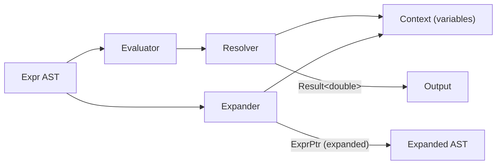
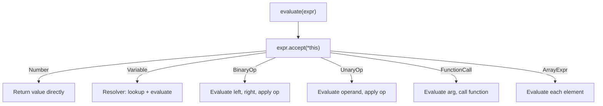
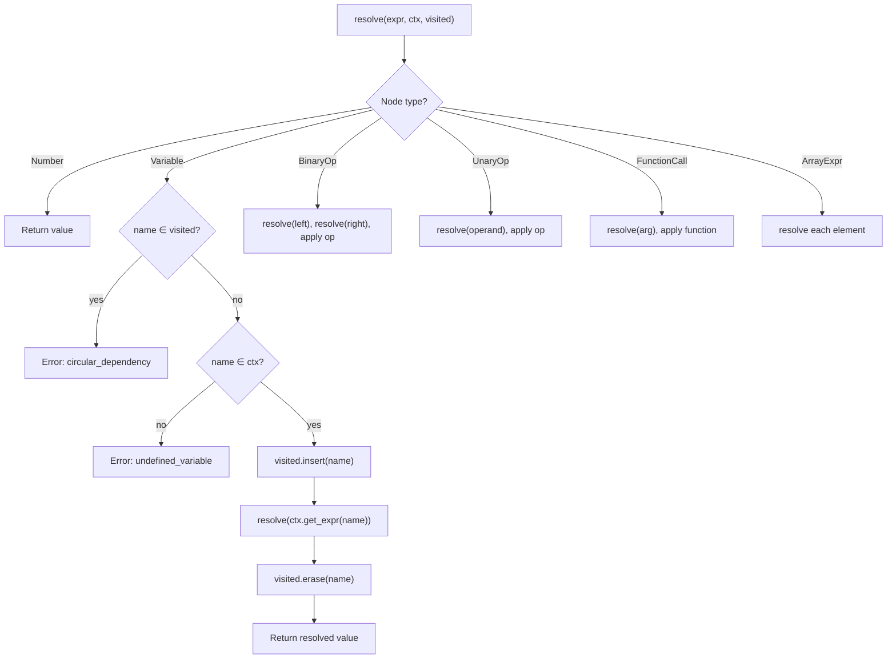

# Evaluation

> **Audience:** Developers who need to understand how AST expressions are evaluated, how variables are resolved lazily, and how broadcast evaluation works.

## Overview

The evaluation pipeline has three key components:

1. **Evaluator** — Visitor that reduces an `Expr` tree to a `double` value
2. **Resolver** — Recursive evaluator with lazy variable resolution and cycle detection
3. **Expander** — Variable inliner that substitutes variable definitions into expressions



---

## Evaluator

**Files:** `src/eval/evaluator.hpp`, `src/eval/evaluator.cpp`

The `Evaluator` implements `ExprVisitor` and reduces an expression tree to a numeric result. It delegates variable resolution to the `Resolver`.

### Evaluation Flow



### Node Evaluation Rules

| Node Type      | Evaluation                                                      |
| -------------- | --------------------------------------------------------------- |
| `Number`       | Return `value_` directly                                        |
| `Variable`     | Look up in `Context`, recursively evaluate the stored `ExprPtr` |
| `BinaryOp(+)`  | `left + right`                                                  |
| `BinaryOp(-)`  | `left - right`                                                  |
| `BinaryOp(*)`  | `left * right`                                                  |
| `BinaryOp(/)`  | `left / right` (division by zero checked)                       |
| `BinaryOp(^)`  | `pow(left, right)`                                              |
| `UnaryOp(Neg)` | `-operand`                                                      |
| `FunctionCall` | Apply `kind_` function to evaluated argument                    |
| `ArrayExpr`    | Evaluate each element → `ArrayExpr` of `Number` results         |

---

## Resolver

**File:** `src/runtime/context/resolver.hpp`, `src/runtime/context/resolver.cpp`

The Resolver performs **lazy variable resolution** — variables store `ExprPtr` (symbolic expressions), not precomputed values. Resolution happens on demand at evaluation time.

### Resolution Algorithm



### Cycle Detection

The `visited_` set tracks which variables are currently being resolved in the call stack:

```
Context: { a = b + 1, b = a + 1 }
Evaluate: a
  → resolve(a): visited = {a}
    → resolve(b + 1)
      → resolve(b): visited = {a, b}
        → resolve(a + 1)
          → resolve(a): "a" ∈ visited → ERROR: circular_dependency
```

**Key invariant:** Insert before recursing, erase after — this correctly handles diamond dependencies (where a variable appears in multiple branches).

### Domain Validation

Functions with restricted domains are checked after argument evaluation:

| Function             | Domain             | Error on          |
| -------------------- | ------------------ | ----------------- |
| `sqrt(x)`            | $x \geq 0$         | Negative argument |
| `ln(x)`, `log(x)`    | $x > 0$            | Zero or negative  |
| `asin(x)`, `acos(x)` | $-1 \leq x \leq 1$ | Outside range     |

Errors are returned as `Result<double>::err(func_domain(...))`.

---

## Expander

**File:** `src/eval/expander.hpp`

The Expander performs **eager variable inlining** — it walks an `Expr` tree and replaces every `Variable` node with the variable's definition from the `Context`. The result is a new AST with no variable references (if all variables are defined and non-cyclic).

### Expansion Rules

| Node Type      | Action                                                                                         |
| -------------- | ---------------------------------------------------------------------------------------------- |
| `Number`       | Return clone                                                                                   |
| `Variable`     | If defined in context → recursively expand the definition; if not → return clone (leave as-is) |
| `BinaryOp`     | Expand left and right, construct new `BinaryOp`                                                |
| `UnaryOp`      | Expand operand, construct new `UnaryOp`                                                        |
| `FunctionCall` | Expand argument, construct new `FunctionCall`                                                  |
| `ArrayExpr`    | Expand each element                                                                            |

### Cycle Safety

The Expander uses a separate cycle detection mechanism (non-strict): if a cyclic reference is encountered, it **leaves the variable unexpanded** rather than producing an error. This is useful for generating display strings without crashing.

### Example

```
Context: { a = 2*x + 1, x = 3 }
Expression: a + 5

Expanded:
  a + 5
  → (2*x + 1) + 5
  → (2*3 + 1) + 5
```

---

## Broadcast Evaluation

When a variable holds an `ArrayExpr`, the evaluator performs **elementwise (broadcast) evaluation**:

```
Context: { x = [1, 2, 3] }
Expression: x^2 + 1

Result: [2, 5, 10]
```

### Algorithm

1. Identify array variables in the expression
2. Validate all arrays have the same size
3. For each index $i$, substitute the $i$-th element and evaluate
4. Collect results into a new `ArrayExpr`

This enables solving equations that produce multiple roots (e.g., quadratic formula) and performing bulk evaluation.

---

## Built-in Functions Reference

All 17 supported functions, grouped by category:

| Category          | Functions                | Notes                              |
| ----------------- | ------------------------ | ---------------------------------- |
| **Trigonometric** | `sin`, `cos`, `tan`      | Radians                            |
| **Inverse trig**  | `asin`, `acos`, `atan`   | Returns radians; domain restricted |
| **Hyperbolic**    | `sinh`, `cosh`, `tanh`   |                                    |
| **Exponential**   | `exp`                    | $e^x$                              |
| **Root**          | `sqrt`                   | $x \geq 0$ required                |
| **Logarithmic**   | `ln`, `log`              | Natural log; $x > 0$ required      |
| **Absolute**      | `abs`                    |                                    |
| **Rounding**      | `floor`, `ceil`, `round` |                                    |

Function dispatch uses `FuncKind` enum (switch statement), not string matching — resolved at parse time.

---

## File Locations

| File                               | Contains                             |
| ---------------------------------- | ------------------------------------ |
| `src/eval/evaluator.hpp`           | `Evaluator` class (ExprVisitor)      |
| `src/eval/evaluator.cpp`           | Evaluation implementation            |
| `src/eval/expander.hpp`            | `Expander` — variable inlining       |
| `src/runtime/context/resolver.hpp` | `Resolver` class                     |
| `src/runtime/context/resolver.cpp` | Lazy resolution with cycle detection |
| `src/runtime/context/context.hpp`  | `Context` — variable storage         |

---

## Further Reading

- [AST](ast.md) — The node types evaluated here
- [Algebra](algebra/README.md) — How expressions are manipulated symbolically
- [Adding a Math Function](../contributing/adding-a-math-function.md) — How to add new functions
