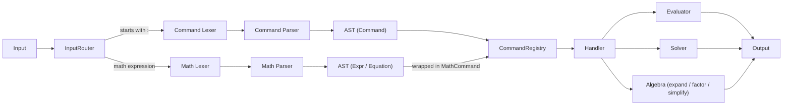
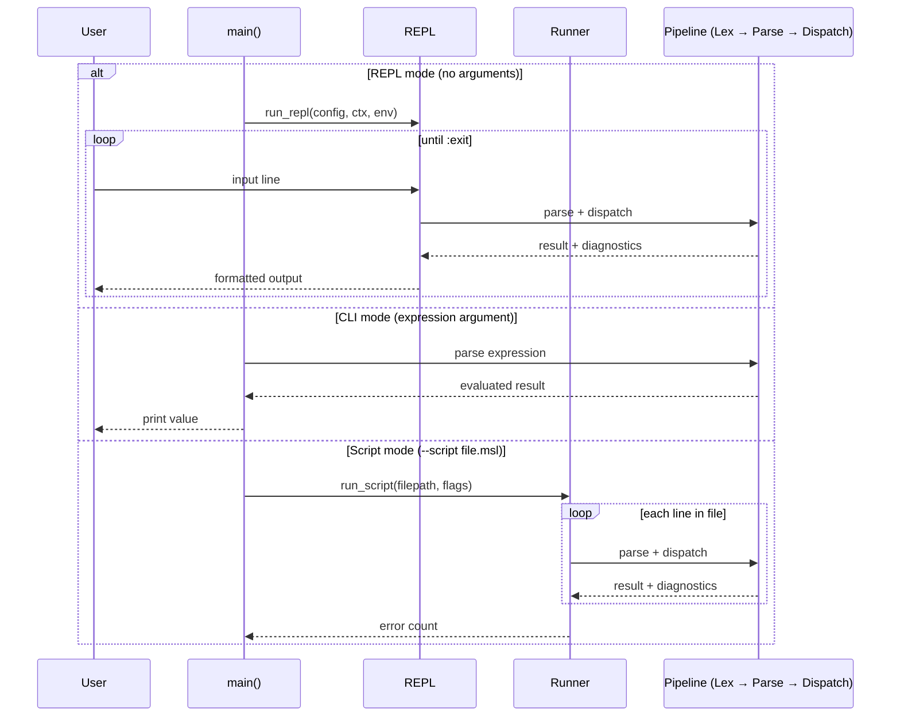
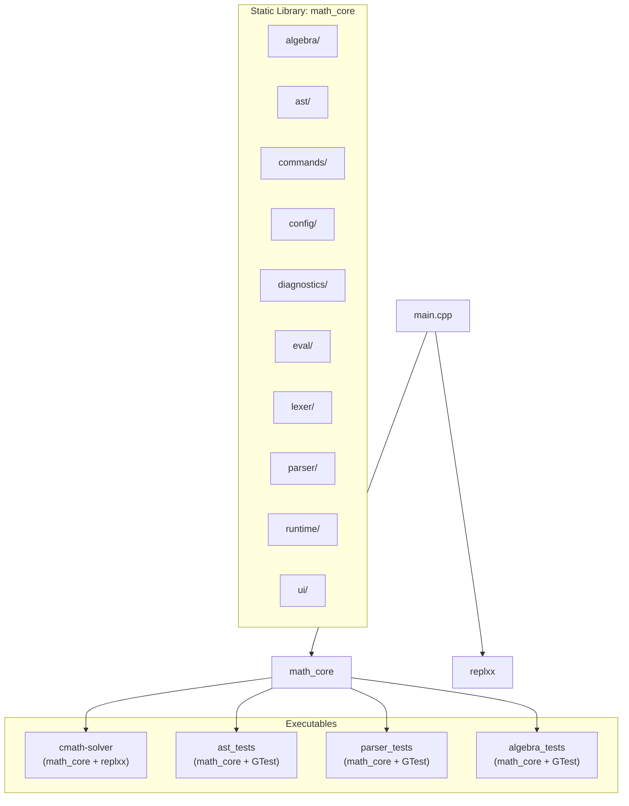

# Architecture Overview

> **Audience:** Developers and contributors who want to understand the high-level design of cmath-solver before diving into individual subsystems.

## Pipeline

Every input—whether typed in the REPL, passed on the command line, or read from a script—flows through the same pipeline:



### Input Routing

The `InputRouter` inspects the first character of trimmed input:

| Prefix                           | Route                                                     | Example             |
| -------------------------------- | --------------------------------------------------------- | ------------------- |
| `:`                              | Command pipeline                                          | `:solve 2x + 3 = 7` |
| Legacy keywords (`exit`, `quit`) | System command                                            | `exit`              |
| Everything else                  | Math expression → wrapped in `MathCommand(Evaluate, ...)` | `2 + 3 * x`         |

Empty input produces a no-op `MathCommand` with an empty payload.

---

## Execution Modes

cmath-solver supports three execution modes, all sharing the same pipeline:



| Mode       | Trigger                | Context                           | Persistence                            |
| ---------- | ---------------------- | --------------------------------- | -------------------------------------- |
| **REPL**   | No arguments           | Persistent across session         | Variables saved to environment on exit |
| **CLI**    | `./cmath-solver "2+3"` | Ephemeral (local context)         | None                                   |
| **Script** | `--script file.msl`    | Persistent with snapshot/rollback | Depends on flags                       |

### Script Flags

| Flag            | Effect                       |
| --------------- | ---------------------------- |
| `--dry-run`     | Parse only, no execution     |
| `--silent`      | Suppress output              |
| `--strict`      | Stop on first error          |
| `--no-rollback` | Keep state even on errors    |
| `--env <name>`  | Execute in named environment |

---

## Build Architecture



### Dependencies (auto-fetched via CMake FetchContent)

| Dependency                                           | Version | Purpose                                      |
| ---------------------------------------------------- | ------- | -------------------------------------------- |
| [nlohmann/json](https://github.com/nlohmann/json)    | 3.11.3  | JSON config persistence                      |
| [replxx](https://github.com/AmokHuginnworker/replxx) | 0.0.4   | REPL line editing, completions, highlighting |
| [GoogleTest](https://github.com/google/googletest)   | 1.17.0  | Unit testing framework                       |

---

## Directory Map

```
src/
├── main.cpp                    # Entry point: CLI / REPL / Script dispatch
├── algebra/                    # Math algorithms
│   ├── linear/                 # Linear equation collection & simplification
│   ├── matrix/                 # System solver (Gauss / LU decomposition)
│   ├── polynomial/             # Polynomial types, AST→poly, factoring
│   └── solver/                 # Single-equation & polynomial solvers
├── ast/                        # Abstract Syntax Tree nodes
│   ├── command/                # Command AST (SystemCommand, VarCommand, ...)
│   └── math/                   # Math AST (Number, BinaryOp, FunctionCall, ...)
├── commands/                   # Command dispatch & handler implementations
│   ├── registry.{hpp,cpp}      # HandlerRegistry (visitor-based dispatch)
│   └── handlers/               # One handler per command family
├── config/                     # JSON config, settings, environments
├── core/                       # Shared primitives (Span, Fraction, tolerance)
├── diagnostics/                # Error types, Result<T>, error factories
│   └── kinds/                  # Per-subsystem error code definitions
├── eval/                       # Evaluator visitor & expression expander
├── lexer/                      # Tokenizers
│   ├── command/                # Command token types & stream
│   └── math/                   # Math token types & lexer
├── parser/                     # Parsers
│   ├── command/                # Command parser & subparser registry
│   │   └── subparsers/         # One subparser per command type
│   └── math/                   # Recursive-descent math parser
├── runtime/                    # Runtime state orchestration
│   └── context/                # Variable storage & lazy resolver
├── ui/                         # Terminal UI
│   └── repl/                   # REPL loop, completions, highlighting, hints
└── utils/                      # String, path, history range utilities
```

---

## Design Principles

### 1. No Exceptions for User Errors

All fallible operations return `Result<T>` — a `std::variant<T, Diagnostic>`. Exceptions are reserved for programmer bugs (assertions). This gives callers explicit control over error propagation.

```cpp
Result<double> result = resolver.evaluate(expr, ctx);
if (result.failed()) {
    sink.push(result.error());
    return;
}
double value = *result;
```

### 2. Visitor Pattern (Double-Dispatch)

Both the math AST (`ExprVisitor`) and command AST (`CommandVisitor`) use the classic Visitor pattern. All visit methods are pure virtual — adding a new node type forces every visitor implementation to handle it at compile time.

### 3. Unique Ownership (`ExprPtr`)

`ExprPtr = std::unique_ptr<Expr>`. Every AST node is heap-allocated with unique ownership. No aliasing, no reference counting. Deep copies are done via `clone()`. This simplifies lifetimes and prevents subtle sharing bugs.

### 4. Source Span Tracking

Every AST node and every `Diagnostic` carries a `Span{start, end}` into the original source. This enables precise error rendering with carets pointing at the exact problematic token.

### 5. Registry-Based Extensibility

New commands are added by:
1. Defining an AST node
2. Writing a subparser
3. Registering in the command parser registry
4. Writing a handler
5. Registering in the handler registry

No modification to the core dispatch loop is needed.

---

## Further Reading

- [AST](ast.md) — Node hierarchies and visitor details
- [Parser](parser.md) — Lexer tokens and parsing algorithms
- [Evaluation](evaluation.md) — How expressions are evaluated
- [Algebra](algebra/README.md) — Solvers and polynomial math
- [Commands](commands.md) — Dispatch and handler details
- [Diagnostics](diagnostics.md) — Error handling architecture
- [Config & Runtime](config-and-runtime.md) — State management
