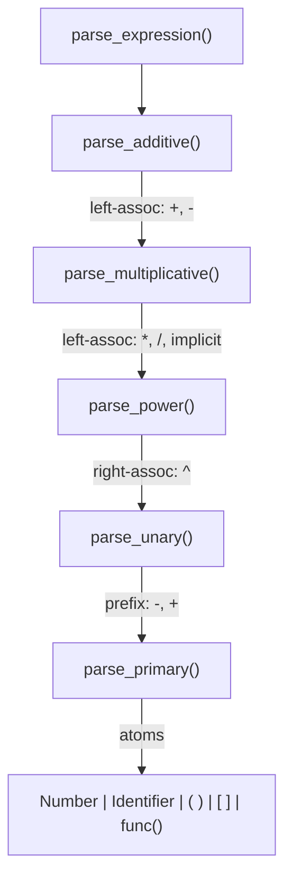
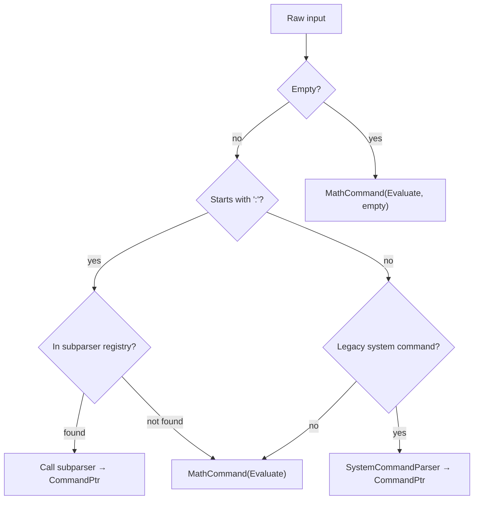
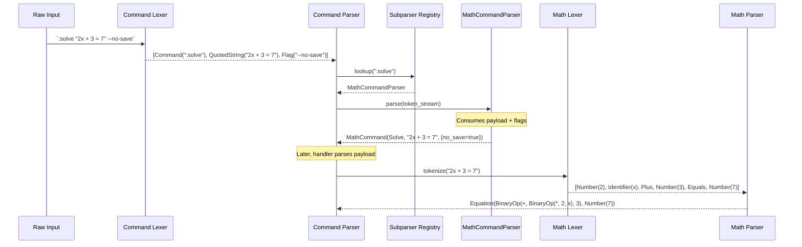

# Lexer & Parser

> **Audience:** Developers who need to understand how raw text is tokenized and parsed into AST nodes.

## Overview

cmath-solver has **two independent lexer/parser pairs**:

1. **Math pipeline** — Tokenizes and parses mathematical expressions into `Expr` / `Equation` nodes
2. **Command pipeline** — Tokenizes and parses `:command` input into `Command` nodes

Both produce AST nodes consumed by downstream visitors (evaluator, handlers).

---

## Math Lexer

**File:** `src/lexer/math/math_lexer.hpp`, `src/lexer/math/math_token.hpp`

### Token Types

| Token Type   | Pattern                  | Example              |
| ------------ | ------------------------ | -------------------- |
| `Number`     | Decimal literal          | `3.14`, `42`, `.5`   |
| `Identifier` | `[a-zA-Z_][a-zA-Z0-9_]*` | `x`, `sin`, `my_var` |
| `Plus`       | `+`                      |                      |
| `Minus`      | `-`                      |                      |
| `Mul`        | `*`                      |                      |
| `Div`        | `/`                      |                      |
| `Pow`        | `^`                      |                      |
| `LParen`     | `(`                      |                      |
| `RParen`     | `)`                      |                      |
| `LBracket`   | `[`                      |                      |
| `RBracket`   | `]`                      |                      |
| `Comma`      | `,`                      |                      |
| `Equals`     | `=`                      |                      |
| `Bang`       | `!`                      |                      |
| `End`        | End of input             |                      |

### Token Structure

```cpp
struct Token {
    TokenType   type;
    double      value;  // For Number tokens
    std::string name;   // For Identifier tokens
    Span        span;   // Source location {start, end}
};
```

### Reserved Keywords

The following identifiers are reserved and cannot be used as variable names:

```
simplify, solve, set, unset, clear, help, exit, quit,
config, env, expand, factor
```

---

## Math Parser

**Files:** `src/parser/math/math_parser.hpp`, `src/parser/math/math_parser.cpp`

### Algorithm: Recursive Descent with Precedence Climbing

The parser is a hand-written recursive descent parser. Operator precedence is encoded in the call hierarchy — each precedence level has its own parsing function.



### Precedence Table

| Level       | Operators          | Associativity | Parser Function          |
| ----------- | ------------------ | ------------- | ------------------------ |
| 1 (lowest)  | `+`, `-`           | Left          | `parse_additive()`       |
| 2           | `*`, `/`, implicit | Left          | `parse_multiplicative()` |
| 3           | `^`                | **Right**     | `parse_power()`          |
| 4           | unary `-`, `+`     | Prefix        | `parse_unary()`          |
| 5 (highest) | atoms              | —             | `parse_primary()`        |

### Implicit Multiplication

Juxtaposed tokens are automatically treated as multiplication. The parser inserts a `BinaryOp(Mul)` node whenever two "multiplicative" tokens appear adjacent without an explicit operator.

| Input     | Parsed As    |
| --------- | ------------ |
| `2x`      | `2 * x`      |
| `3(x+1)`  | `3 * (x+1)`  |
| `2sin(x)` | `2 * sin(x)` |
| `xy`      | `x * y`      |
| `(a)(b)`  | `a * b`      |

Detection rule: if the current token can start a primary expression (Number, Identifier, LParen, LBracket) and the previous parse produced a valid expression, insert implicit `*`.

### Right-Associative Exponentiation

`^` binds right-to-left:

```
2^3^4  →  2^(3^4)  →  2^81
```

Implementation: `parse_power()` recursively calls itself for the right operand:

```cpp
ExprPtr parse_power() {
    auto base = parse_unary();
    if (current_.type == TokenType::Pow) {
        advance();
        auto exp = parse_power();  // Right-recursive!
        return make_unique<BinaryOp>(move(base), move(exp), BinaryOpType::Pow);
    }
    return base;
}
```

### Function Call Parsing

When `parse_primary()` encounters an `Identifier`:

```mermaid
flowchart TD
    id["Identifier token"]
    check{"Next token is '('?"}
    func["func_kind_from_name()"]
    found{"Known function?"}
    call["Parse argument → FunctionCall node"]
    var["Variable node"]
    err["Parse error: unknown function"]

    id --> check
    check -->|yes| func
    check -->|no| var
    func --> found
    found -->|yes| call
    found -->|no| err
```

### Array Literal Parsing

```
[e0, e1, ..., en]
```

Parsed by `parse_primary()` when it encounters `LBracket`. Each element is a full `parse_expression()` call, separated by commas.

### Equation Parsing

`parse_expression_or_equation()` first parses an expression, then checks for `=`. If found, it parses the right-hand side and wraps both in an `Equation`:

```
lhs_expr = rhs_expr  →  Equation(lhs, rhs)
```

### Entry Points

| Method                           | Returns                              | Use Case                             |
| -------------------------------- | ------------------------------------ | ------------------------------------ |
| `parse()`                        | `Result<ExprPtr>`                    | Single expression, no trailing input |
| `parse_expression_or_equation()` | `Result<pair<ExprPtr, EquationPtr>>` | Expression or equation               |
| `parse_equation()`               | `Result<EquationPtr>`                | Equation only                        |

### Error Handling

- No exceptions — returns `Result<T>`
- `expect(TokenType)` checks current token, emits `ParseError` on mismatch
- `last_error_` captures the first error for propagation
- All errors include the source `Span` for precise caret rendering

---

## Command Lexer

**Files:** `src/lexer/command/command_lexer.hpp`, `src/lexer/command/command_token.hpp`

### Token Types

| Token Type     | Pattern             | Example                     |
| -------------- | ------------------- | --------------------------- |
| `Command`      | `:identifier`       | `:solve`, `:set`            |
| `Flag`         | `-flag` or `--flag` | `--no-save`, `-v`           |
| `Word`         | Unquoted string     | `x`, `workspace1`, `2x+3=7` |
| `QuotedString` | `"..."`             | `"2x + 3 = 7"`              |
| `Comma`        | `,`                 |                             |
| `Eof`          | End of input        |                             |

### Token Structure

```cpp
struct CommandToken {
    CommandTokenType type;
    std::string      value;  // Content (quotes stripped for QuotedString)
    size_t           start;  // Byte offset
    size_t           end;    // Byte offset
};
```

---

## Command Parser

**Files:** `src/parser/command/command_parser.hpp`, `src/parser/command/command_parser.cpp`

### Dispatch Logic



**Result:** Always returns a non-null `CommandPtr`. Unknown input falls back to `MathCommand(Evaluate, input)`.

### Subparser Registry

**File:** `src/parser/command/command_parser_registry.cpp`

The registry maps command names to subparser implementations:

| Command(s)                                                     | Subparser              | Produces         |
| -------------------------------------------------------------- | ---------------------- | ---------------- |
| `:solve`, `:simplify`, `:expand`, `:factor`                    | `MathCommandParser`    | `MathCommand`    |
| `:set`, `:unset`, `:rm`                                        | `VarCommandParser`     | `VarCommand`     |
| `:env`                                                         | `EnvCommandParser`     | `EnvCommand`     |
| `:config`, `:conf`                                             | `ConfigCommandParser`  | `ConfigCommand`  |
| `:load`                                                        | `LoadCommandParser`    | `LoadCommand`    |
| `:history`                                                     | `HistoryCommandParser` | `HistoryCommand` |
| `:redo`                                                        | `RedoCommandParser`    | `RedoCommand`    |
| `:exit`, `:quit`, `:q`, `:help`, `:h`, `:clear`, `:cls`, `:ls` | `SystemCommandParser`  | `SystemCommand`  |

### Subparser Interface

```cpp
class ICommandSubparser {
public:
    virtual ~ICommandSubparser() = default;
    virtual Result<CommandPtr> parse(ITokenStream& stream) = 0;
};
```

**Contract:**
- Implementations consume a valid command or leave the stream recoverable
- Partial consumption is discouraged
- Subparsers should be stateless or reentrant

### Token Stream

Each subparser receives an `ITokenStream` providing:

```cpp
class ITokenStream {
public:
    virtual CommandToken peek() const = 0;
    virtual CommandToken advance() = 0;
    virtual bool at_end() const = 0;
    virtual std::string raw_input() const = 0;
};
```

This abstraction decouples subparsers from the lexer implementation.

---

## Parse Flow Example

Parsing `:solve "2x + 3 = 7" --no-save`:



---

## File Locations

| File                                             | Contains                                |
| ------------------------------------------------ | --------------------------------------- |
| `src/lexer/math/math_token.hpp`                  | `Token`, `TokenType`                    |
| `src/lexer/math/math_lexer.hpp`                  | `Lexer` (math tokenizer)                |
| `src/lexer/command/command_token.hpp`            | `CommandToken`, `CommandTokenType`      |
| `src/lexer/command/command_lexer.hpp`            | `CommandLexer`                          |
| `src/lexer/command/command_token_stream.hpp`     | `CommandTokenStream`                    |
| `src/lexer/command/token_stream.hpp`             | `ITokenStream` interface                |
| `src/parser/math/math_parser.hpp`                | `MathParser` class                      |
| `src/parser/math/math_parser.cpp`                | Parser implementation                   |
| `src/parser/command/command_parser.hpp`          | `CommandParser` entry point             |
| `src/parser/command/command_parser.cpp`          | Dispatch logic                          |
| `src/parser/command/command_parser_registry.hpp` | `SubparserRegistry`, `build_registry()` |
| `src/parser/command/command_parser_registry.cpp` | All command registrations               |
| `src/parser/command/subparsers/`                 | Individual subparser implementations    |

---

## Further Reading

- [AST](ast.md) — The nodes produced by these parsers
- [Evaluation](evaluation.md) — How parsed expressions are evaluated
- [Adding a Command](../contributing/adding-a-command.md) — How to write a new subparser
