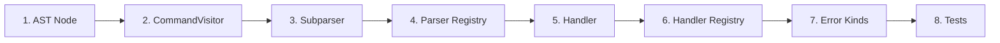

# Adding a New Command

> **Step-by-step guide for adding a new `:command` to cmath-solver.**
>
> This walkthrough uses `:history` as a reference implementation (medium complexity, representative pattern).

## Overview

Adding a command touches 8 areas of the codebase:



---

## Step 1: Define the AST Node

**Create:** `src/ast/command/my_command.hpp`

```cpp
#pragma once

#include "ast/command/command.hpp"
#include <string>

namespace math_solver {

class MyCommand : public Command {
public:
    enum class Action { DoSomething, DoOther, Unknown };

private:
    Action action_;
    std::string payload_;

public:
    explicit MyCommand(const std::string& raw, Action action = Action::Unknown)
        : Command(raw), action_(action) {}

    Action action() const { return action_; }
    const std::string& payload() const { return payload_; }
    void set_payload(const std::string& p) { payload_ = p; }

    void accept(CommandVisitor& visitor, DiagnosticSink& sink) const override {
        visitor.visit(*this, sink);
    }
};

} // namespace math_solver
```

**Key points:**
- Inherit from `Command`
- Store the raw command string (for diagnostics)
- Implement `accept()` to call `visitor.visit(*this, sink)`
- Keep fields minimal — parse what you need, no more

**Reference:** `src/ast/command/history_command.hpp`

---

## Step 2: Update CommandVisitor

**Edit:** `src/ast/command/command_visitor.hpp`

Add a forward declaration and visit method:

```cpp
class MyCommand;  // Forward declaration

class CommandVisitor {
public:
    // ... existing visit methods ...
    virtual void visit(const MyCommand& cmd, DiagnosticSink& sink) = 0;
};
```

> **This will cause compile errors** in every `CommandVisitor` implementation until you add the new `visit()` override. That's intentional — it forces you to handle the new command everywhere.

---

## Step 3: Write the Subparser

**Create:** `src/parser/command/subparsers/my_command_parser.hpp` and `my_command_parser.cpp`

**Header:**

```cpp
#pragma once

#include "parser/command/subparsers/icommand_subparser.hpp"

namespace math_solver {

class MyCommandParser : public ICommandSubparser {
public:
    Result<CommandPtr> parse(ITokenStream& stream) override;
};

} // namespace math_solver
```

**Implementation:**

```cpp
#include "parser/command/subparsers/my_command_parser.hpp"
#include "ast/command/my_command.hpp"

namespace math_solver {

Result<CommandPtr> MyCommandParser::parse(ITokenStream& stream) {
    auto cmd = std::make_unique<MyCommand>(stream.raw_input());

    // Consume tokens from stream to populate the command
    auto token = stream.advance();  // Skip the command token itself

    if (stream.at_end()) {
        // Default behavior when no arguments
        cmd->set_action(MyCommand::Action::DoSomething);
        return Result<CommandPtr>::ok(std::move(cmd));
    }

    // Parse subcommands, flags, arguments...
    auto next = stream.peek();
    if (next.type == CommandTokenType::Word) {
        if (next.value == "something") {
            cmd->set_action(MyCommand::Action::DoSomething);
            stream.advance();
        } else if (next.value == "other") {
            cmd->set_action(MyCommand::Action::DoOther);
            stream.advance();
        }
    }

    return Result<CommandPtr>::ok(std::move(cmd));
}

} // namespace math_solver
```

**Reference:** `src/parser/command/subparsers/history_command_parser.cpp`

---

## Step 4: Register in the Parser Registry

**Edit:** `src/parser/command/command_parser_registry.cpp`

```cpp
#include "parser/command/subparsers/my_command_parser.hpp"

SubparserRegistry build_registry() {
    SubparserRegistry registry;
    // ... existing registrations ...

    // Register your command
    auto my_parser = std::make_unique<MyCommandParser>();
    registry[":mycommand"] = std::move(my_parser);
    // Add aliases if needed:
    // registry[":mc"] = std::make_unique<MyCommandParser>();

    return registry;
}
```

Also add your command to `registered_command_names()` if it tracks registered names.

---

## Step 5: Write the Handler

**Create:** `src/commands/handlers/my_handler.hpp`

```cpp
#pragma once

#include "ast/command/my_command.hpp"
#include "ast/command/history_entry.hpp"
#include "config/config.hpp"
#include "diagnostics/sink.hpp"
#include "runtime/context/context.hpp"

namespace math_solver {

inline HistoryStatus handle_my_do_something(
    const MyCommand& cmd, Context& ctx, Config& config,
    std::string& output, DiagnosticSink& sink) {

    // Implement the command logic
    output = "Did something!\n";
    return HistoryStatus::Success;
}

inline HistoryStatus handle_my_do_other(
    const MyCommand& cmd, Context& ctx, Config& config,
    std::string& output, DiagnosticSink& sink) {

    output = "Did other thing!\n";
    return HistoryStatus::Success;
}

} // namespace math_solver
```

**Key points:**
- Each action gets its own handler function
- Write output to the `output` string reference
- Push errors to `sink` (not `cerr`)
- Return appropriate `HistoryStatus`

**Reference:** `src/commands/handlers/history_handler.hpp`

---

## Step 6: Register in the Handler Registry

**Edit:** `src/commands/registry.cpp`

In `build_handler_registry()`, add your command's sub-registry:

```cpp
#include "commands/handlers/my_handler.hpp"

// In build_handler_registry():
auto& my_reg = registry.my_registry_;  // Add this field to HandlerRegistry
my_reg.add(MyCommand::Action::DoSomething, handle_my_do_something);
my_reg.add(MyCommand::Action::DoOther, handle_my_do_other);
```

**Edit:** `src/commands/registry.hpp`

Add the sub-registry field and visit override:

```cpp
class HandlerRegistry : public CommandVisitor {
    // ... existing registries ...
    CommandRegistry<MyCommand, MyCommand::Action> my_registry_;

public:
    void visit(const MyCommand& cmd, DiagnosticSink& sink) override {
        my_registry_.dispatch(cmd, ctx_, config_, output_, sink);
    }
};
```

---

## Step 7: Add Error Kinds (if needed)

**Create:** `src/diagnostics/kinds/my_errors.hpp`

```cpp
#pragma once

#include "diagnostics/diagnostic.hpp"

namespace math_solver {
namespace errors {

inline Diagnostic my_missing_arg(const std::string& raw,
                                  const std::string& token,
                                  const std::string& file,
                                  size_t line) {
    auto d = Diagnostic::make("missing argument", "E0XXX",
                              find_token_span(raw, token), raw,
                              "argument expected here")
                 .with_location(file, line);
    d.help = "Usage: :mycommand <arg>";
    return d;
}

} // namespace errors
} // namespace math_solver
```

Choose an error code in an unused range. See [Error Code Reference](../reference/error-codes.md) for current allocations.

---

## Step 8: Add Tests

### Unit Tests

**Create or edit** a test file in `tests/ast/command/` for AST node tests and `tests/parser/` for parser tests.

```cpp
TEST(MyCommandTest, ParseDoSomething) {
    auto result = parse_command(":mycommand something");
    ASSERT_TRUE(result.ok());
    auto* cmd = dynamic_cast<const MyCommand*>(result->get());
    ASSERT_NE(cmd, nullptr);
    EXPECT_EQ(cmd->action(), MyCommand::Action::DoSomething);
}
```

### UI Tests

**Create:** `tests/ui/my_command.msl`

```msl
# Test basic my_command behavior
:mycommand something
:mycommand other
```

**Run with `--bless` to generate expected output:**

```bash
python3 tests/run_ui_tests.py --binary ./build/bin/cmath-solver --tests-dir tests/ui --bless
```

This creates `tests/ui/my_command.stderr` with the expected output.

### Update CMakeLists.txt

Add new `.cpp` source files to the appropriate target if you created new implementation files:

```cmake
# In CMakeLists.txt, add to math_core sources:
add_library(math_core STATIC
    # ... existing sources ...
    src/parser/command/subparsers/my_command_parser.cpp
)
```

---

## Checklist

- [ ] AST node in `src/ast/command/my_command.hpp`
- [ ] `CommandVisitor::visit(const MyCommand&, ...)` in `command_visitor.hpp`
- [ ] Subparser in `src/parser/command/subparsers/`
- [ ] Registered in `command_parser_registry.cpp`
- [ ] Handler functions in `src/commands/handlers/my_handler.hpp`
- [ ] Sub-registry + visit override in `registry.hpp` / `registry.cpp`
- [ ] Error kinds in `src/diagnostics/kinds/` (if applicable)
- [ ] Unit tests for AST node and parser
- [ ] UI tests (`.msl` + `.stderr`)
- [ ] CMakeLists.txt updated (if new `.cpp` files)
- [ ] Documentation updated (README if user-facing)

---

## Reference Implementations

| Complexity | Command          | Good For Learning                                |
| ---------- | ---------------- | ------------------------------------------------ |
| Simple     | `SystemCommand`  | Minimal: enum dispatch, no payload parsing       |
| Medium     | `HistoryCommand` | Subcommands, flags, range parsing                |
| Complex    | `MathCommand`    | Payload re-parsing, multiple flags, system solve |
| Complex    | `EnvCommand`     | Multi-action with cross-cutting concerns         |
