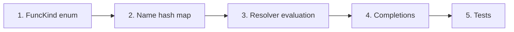

# Adding a Math Function

> **Step-by-step guide for adding a new built-in math function (e.g., `cot`, `sec`, `log2`).**
>
> Math functions are among the easiest features to add — no new AST nodes needed. You extend the existing `FunctionCall` infrastructure.

## Overview



---

## Step 1: Add to the FuncKind Enum

**Edit:** `src/ast/math/call_expr.hpp`

```cpp
enum class FuncKind {
    Sin, Cos, Tan,
    Asin, Acos, Atan,
    Sinh, Cosh, Tanh,
    Exp, Sqrt, Ln, Log,
    Abs, Floor, Ceil, Round,
    Cot  // ← ADD YOUR FUNCTION HERE
};
```

---

## Step 2: Register in the Name Lookup Table

**Edit:** `src/ast/math/call_expr.hpp` — inside `func_kind_from_name()`:

```cpp
inline std::optional<FuncKind> func_kind_from_name(const std::string& name) {
    static const std::unordered_map<std::string, FuncKind> table = {
        {"sin",   FuncKind::Sin},
        {"cos",   FuncKind::Cos},
        // ... existing entries ...
        {"round", FuncKind::Round},
        {"cot",   FuncKind::Cot},   // ← ADD THIS
    };
    auto it = table.find(name);
    if (it == table.end()) return std::nullopt;
    return it->second;
}
```

This single hash map is the authoritative list of known function names. The parser uses it at parse time to resolve identifiers to `FuncKind`.

---

## Step 3: Add Evaluation in the Resolver

**Edit:** `src/runtime/context/resolver.cpp`

Find the switch statement inside the `FunctionCall` visit handler and add your case:

```cpp
case FuncKind::Cot: {
    double sin_val = std::sin(arg_value);
    if (std::abs(sin_val) < kEpsilon) {
        // Domain error: cot is undefined where sin = 0
        error_ = errors::func_domain(
            "cot() undefined at multiples of π",
            node.span(), input_);
        return;
    }
    result_ = std::cos(arg_value) / sin_val;
    break;
}
```

**Domain validation:** If your function has restricted domain (like `sqrt` requires $x \geq 0$, or `asin` requires $|x| \leq 1$), add the check before computing the value.

### Domain Check Examples

| Function  | Domain Check   | Error Message                           |
| --------- | -------------- | --------------------------------------- |
| `sqrt(x)` | `x >= 0`       | "sqrt() requires non-negative argument" |
| `ln(x)`   | `x > 0`        | "ln() requires positive argument"       |
| `asin(x)` | `-1 <= x <= 1` | "asin() argument must be in [-1, 1]"    |
| `cot(x)`  | `sin(x) != 0`  | "cot() undefined at multiples of π"     |

---

## Step 4: Add to Tab Completions

**Edit:** `src/ui/repl/completions.hpp`

Find the list of math function names and add yours:

```cpp
// In the completions callback
static const std::vector<std::string> math_functions = {
    "sin", "cos", "tan",
    "asin", "acos", "atan",
    "sinh", "cosh", "tanh",
    "exp", "sqrt", "ln", "log",
    "abs", "floor", "ceil", "round",
    "cot"  // ← ADD THIS
};
```

This enables tab-completion when the user types `co` → suggests `cos`, `cosh`, `cot`.

---

## Step 5: Add Tests

### Unit Test

**Add to:** `tests/ast/math/` or create a new test file

```cpp
TEST(FunctionCallTest, CotKnown) {
    auto kind = func_kind_from_name("cot");
    ASSERT_TRUE(kind.has_value());
    EXPECT_EQ(*kind, FuncKind::Cot);
}
```

### Evaluation Test

Test that the function evaluates correctly:

```cpp
TEST(ResolverTest, EvaluateCot) {
    // cot(π/4) = 1
    auto expr = make_function_call("cot",
        std::make_unique<BinaryOp>(
            make_pi(), std::make_unique<Number>(4.0), BinaryOpType::Div));

    Context ctx;
    auto result = resolve(expr, ctx);
    ASSERT_TRUE(result.ok());
    EXPECT_NEAR(*result, 1.0, 1e-10);
}
```

### Domain Error Test

Test that domain errors are properly reported:

```cpp
TEST(ResolverTest, CotDomainError) {
    // cot(0) should error (sin(0) = 0)
    auto expr = make_function_call("cot", std::make_unique<Number>(0.0));

    Context ctx;
    auto result = resolve(expr, ctx);
    EXPECT_TRUE(result.failed());
    EXPECT_EQ(result.error().code, "E0002");  // func_domain
}
```

### UI Test

**Create:** `tests/ui/math_functions.msl` (or add to existing)

```msl
# Test cot function
cot(1)
cot(0)
```

Run with `--bless` to generate expected output.

---

## Checklist

- [ ] `FuncKind::Cot` added to enum in `src/ast/math/call_expr.hpp`
- [ ] `{"cot", FuncKind::Cot}` added to `func_kind_from_name()` hash map
- [ ] `case FuncKind::Cot:` added to Resolver switch in `src/runtime/context/resolver.cpp`
- [ ] Domain validation added (if applicable)
- [ ] Function name added to completions in `src/ui/repl/completions.hpp`
- [ ] Unit test for `func_kind_from_name()`
- [ ] Evaluation test with correct result
- [ ] Domain error test (if applicable)
- [ ] UI test (`.msl` + `.stderr`)

---

## What You Don't Need to Change

Unlike adding a new AST node, adding a math function does **not** require:

- ❌ New AST node (reuses `FunctionCall`)
- ❌ `ExprVisitor` changes (reuses existing `visit(const FunctionCall&)`)
- ❌ LinearCollector changes (already rejects all function calls with variable args)
- ❌ AstToPoly changes (already rejects function calls)
- ❌ Expander changes (already handles function calls generically)
- ❌ Parser changes (identifier + `(` already parsed as function call)

The `FunctionCall` node + `FuncKind` enum design means new functions are a minimal, localized change.

---

## Currently Supported Functions

For reference, here are all 17 currently supported functions:

| Category      | Functions                |
| ------------- | ------------------------ |
| Trigonometric | `sin`, `cos`, `tan`      |
| Inverse trig  | `asin`, `acos`, `atan`   |
| Hyperbolic    | `sinh`, `cosh`, `tanh`   |
| Exponential   | `exp`                    |
| Root          | `sqrt`                   |
| Logarithmic   | `ln`, `log`              |
| Absolute      | `abs`                    |
| Rounding      | `floor`, `ceil`, `round` |
