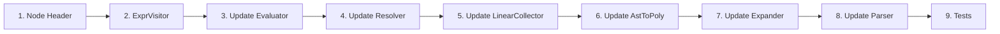

# Adding a New AST Node

> **Step-by-step guide for adding a new expression type to the math AST.**
>
> This is needed when the language gains a new syntactic construct (e.g., ternary expressions, matrix literals, range expressions).

## Overview

Adding a new math AST node requires updating every visitor implementation. The compiler enforces this — pure virtual methods mean you can't forget.



---

## Step 1: Create the Node Header

**Create:** `src/ast/math/my_node_expr.hpp`

```cpp
#pragma once

#include "ast/math/expr.hpp"

namespace math_solver {

class MyNode : public Expr {
    // Fields for your node
    ExprPtr child_;
    int some_property_;

public:
    MyNode(ExprPtr child, int prop, const Span& span = Span())
        : Expr(span), child_(std::move(child)), some_property_(prop) {}

    const Expr& child() const { return *child_; }
    int some_property() const { return some_property_; }

    void accept(ExprVisitor& visitor) const override {
        visitor.visit(*this);
    }

    std::string to_string() const override {
        return "mynode(" + child_->to_string() + ")";
    }

    std::unique_ptr<Expr> clone() const override {
        return std::make_unique<MyNode>(child_->clone(), some_property_, span_);
    }
};

} // namespace math_solver
```

**Requirements:**
- Inherit from `Expr`
- Accept a `Span` for source tracking
- Implement `accept()` → calls `visitor.visit(*this)`
- Implement `to_string()` → stable, parseable representation
- Implement `clone()` → deep copy (clone all `ExprPtr` children)
- Own children via `ExprPtr` (unique ownership, no aliasing)

---

## Step 2: Update ExprVisitor

**Edit:** `src/ast/math/expr_visitor.hpp`

```cpp
class MyNode;  // Forward declaration

class ExprVisitor {
public:
    // ... existing visit methods ...
    virtual void visit(const MyNode& node) = 0;  // ADD THIS
};
```

> **After this edit, the project will not compile** until all visitor implementations handle the new node. This is the key safety mechanism.

---

## Step 3: Update the Evaluator

**Edit:** `src/eval/evaluator.hpp` and/or `src/eval/evaluator.cpp`

```cpp
#include "ast/math/my_node_expr.hpp"

void Evaluator::visit(const MyNode& node) {
    // Evaluate the child first
    node.child().accept(*this);
    double child_value = result_;

    // Apply your node's semantics
    result_ = do_something(child_value, node.some_property());
}
```

---

## Step 4: Update the Resolver

**Edit:** `src/runtime/context/resolver.cpp`

```cpp
void Resolver::visit(const MyNode& node) {
    // Resolve child (handles variable lookup + cycle detection)
    node.child().accept(*this);
    if (failed_) return;
    double child_value = result_;

    // Apply semantics
    result_ = do_something(child_value, node.some_property());
}
```

---

## Step 5: Update LinearCollector

**Edit:** `src/algebra/linear/linear_collector.hpp`

If your node is linear, add collection logic. If not, reject it:

```cpp
void visit(const MyNode& node) override {
    // Option A: If the node is inherently non-linear
    error_ = errors::polynomial("MyNode expressions are not linear", node.span(), input_);

    // Option B: If it can be linear (e.g., just wraps a child)
    // node.child().accept(*this);
}
```

---

## Step 6: Update AstToPoly

**Edit:** `src/algebra/polynomial/ast_to_poly.hpp`

If your node can be converted to polynomial form, implement it. Otherwise reject:

```cpp
void visit(const MyNode& node) override {
    // Option A: Reject
    result_ = Result<Polynomial>::err(
        errors::polynomial("cannot convert MyNode to polynomial", node.span(), input_));

    // Option B: Convert (if applicable)
    // node.child().accept(*this);
    // Polynomial p = *result_;
    // result_ = transform(p, node.some_property());
}
```

---

## Step 7: Update the Expander

**Edit:** `src/eval/expander.hpp`

```cpp
void visit(const MyNode& node) override {
    // Expand the child's variables
    node.child().accept(*this);
    ExprPtr expanded_child = std::move(result_);

    // Reconstruct with expanded child
    result_ = std::make_unique<MyNode>(
        std::move(expanded_child), node.some_property(), node.span());
}
```

---

## Step 8: Update the Parser

**Edit:** `src/parser/math/math_parser.cpp`

Add parsing logic at the appropriate precedence level. Most new constructs go in `parse_primary()`:

```cpp
ExprPtr MathParser::parse_primary() {
    // ... existing cases ...

    // Example: parse `mynode(expr)` syntax
    if (current_.type == TokenType::Identifier && current_.name == "mynode") {
        auto start = current_.span;
        advance();
        expect(TokenType::LParen);
        auto child = parse_expression();
        expect(TokenType::RParen);
        return std::make_unique<MyNode>(
            std::move(child), 0, start.merge(previous_span()));
    }

    // ... rest of parse_primary ...
}
```

---

## Step 9: Add Tests

### AST Node Tests

**Create:** `tests/ast/math/test_my_node_expr.cpp`

```cpp
#include <gtest/gtest.h>
#include "ast/math/my_node_expr.hpp"

TEST(MyNodeTest, Construction) {
    auto child = std::make_unique<Number>(42.0);
    MyNode node(std::move(child), 5);
    EXPECT_EQ(node.some_property(), 5);
    EXPECT_EQ(node.to_string(), "mynode(42)");
}

TEST(MyNodeTest, Clone) {
    auto child = std::make_unique<Number>(42.0);
    MyNode node(std::move(child), 5);
    auto cloned = node.clone();
    EXPECT_EQ(cloned->to_string(), "mynode(42)");
}
```

### Parser Tests

**Add to:** `tests/parser/test_math_parser.cpp`

```cpp
TEST(MathParserTest, ParseMyNode) {
    MathParser parser("mynode(42)");
    auto result = parser.parse();
    ASSERT_TRUE(result.ok());
    auto* node = dynamic_cast<const MyNode*>(result->get());
    ASSERT_NE(node, nullptr);
    EXPECT_EQ(node->some_property(), 0);
}
```

### Evaluation Tests

Test that evaluation produces correct results:

```cpp
TEST(EvaluatorTest, EvaluateMyNode) {
    // Build AST: mynode(42)
    auto expr = std::make_unique<MyNode>(std::make_unique<Number>(42.0), 5);
    Context ctx;
    Evaluator eval(&ctx, "mynode(42)", &sink);
    // ... evaluate and check result
}
```

### Update CMakeLists.txt

Add new `.cpp` files to the appropriate test target.

---

## Checklist

- [ ] Node header in `src/ast/math/my_node_expr.hpp`
  - [ ] Inherits from `Expr`
  - [ ] `accept()` calls `visitor.visit(*this)`
  - [ ] `to_string()` returns stable string
  - [ ] `clone()` deep-copies all children
- [ ] `ExprVisitor::visit(const MyNode&)` added
- [ ] `Evaluator::visit(const MyNode&)` implemented
- [ ] `Resolver::visit(const MyNode&)` implemented (with cycle detection)
- [ ] `LinearCollector::visit(const MyNode&)` implemented (or rejects)
- [ ] `AstToPoly::visit(const MyNode&)` implemented (or rejects)
- [ ] `Expander::visit(const MyNode&)` implemented
- [ ] Math parser updated to produce `MyNode`
- [ ] AST unit tests
- [ ] Parser unit tests
- [ ] Evaluation tests
- [ ] CMakeLists.txt updated

---

## Common Patterns

### Leaf Node (no children)

Like `Number` or `Variable`. No recursive traversal needed in visitors. Clone just copies fields.

### Unary Node (one child)

Like `UnaryOp` or `FunctionCall`. Visitors recurse into the single child. Clone calls `child_->clone()`.

### Binary Node (two children)

Like `BinaryOp`. Visitors evaluate both sides. Clone calls `left_->clone()` and `right_->clone()`.

### Compound Node (many children)

Like `ArrayExpr`. Use `vector<ExprPtr>`. Visitors iterate over children. Clone iterates and clones each.
