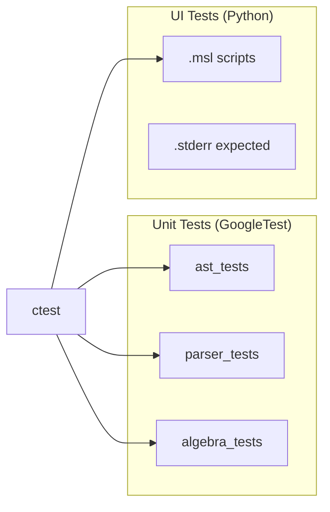
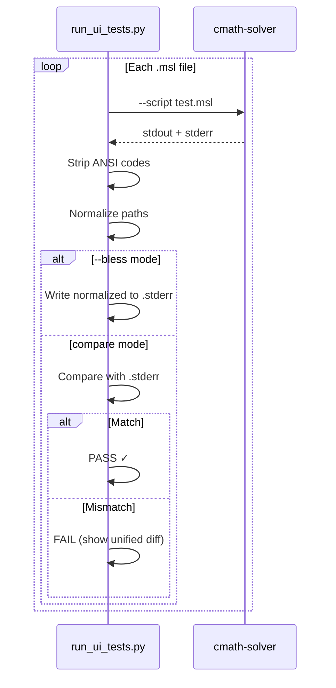

# Testing Guide

> **How to write, run, and maintain tests for cmath-solver.**

## Test Framework Overview

cmath-solver uses two complementary test systems:

| System         | Framework            | What It Tests                           | Location                                        |
| -------------- | -------------------- | --------------------------------------- | ----------------------------------------------- |
| **Unit tests** | GoogleTest 1.17.0    | Individual C++ classes and functions    | `tests/ast/`, `tests/algebra/`, `tests/parser/` |
| **UI tests**   | Custom Python runner | End-to-end behavior via `--script` mode | `tests/ui/`                                     |



---

## Running Tests

### All Tests

```bash
cd build && ctest
```

This runs both unit tests and UI tests through CTest.

### Unit Tests Only

```bash
# All unit tests
./build/bin/ast_tests
./build/bin/parser_tests
./build/bin/algebra_tests

# Filtered by name
./build/bin/ast_tests --gtest_filter="*BinaryExpr*"
./build/bin/parser_tests --gtest_filter="MathParser.*"
./build/bin/algebra_tests --gtest_filter="*LinearForm*"
```

### UI Tests Only

```bash
python3 tests/run_ui_tests.py \
    --binary ./build/bin/cmath-solver \
    --tests-dir tests/ui
```

### Regenerate Expected Output (Bless)

After making an intentional change to output formatting:

```bash
python3 tests/run_ui_tests.py \
    --binary ./build/bin/cmath-solver \
    --tests-dir tests/ui \
    --bless
```

This overwrites all `.stderr` files with the current actual output. **Always review the diff after blessing** to confirm nothing unexpected changed.

---

## Unit Tests (GoogleTest)

### Test Executables

| Executable      | Links                                                                                              | Source           |
| --------------- | -------------------------------------------------------------------------------------------------- | ---------------- |
| `ast_tests`     | GTest + nlohmann_json + replxx (compiles `diagnostic.cpp` directly; does **not** link `math_core`) | `tests/ast/`     |
| `parser_tests`  | GTest + `math_core`                                                                                | `tests/parser/`  |
| `algebra_tests` | GTest + `math_core`                                                                                | `tests/algebra/` |

### Writing a Unit Test

Create a `.cpp` file in the appropriate `tests/` subdirectory:

```cpp
#include <gtest/gtest.h>
#include "ast/math/number_expr.hpp"

using namespace cmath_solver;

TEST(NumberExprTest, StoresValue) {
    Number num(42.0, Span{0, 2});
    EXPECT_EQ(num.value, 42.0);
}

TEST(NumberExprTest, AcceptsVisitor) {
    Number num(3.14, Span{0, 4});
    MockExprVisitor visitor;
    EXPECT_CALL(visitor, visit(testing::Ref(num))).Times(1);
    num.accept(visitor);
}
```

### Test Naming Conventions

- **Test suite name:** Class or module being tested (`NumberExprTest`, `LinearFormTest`, `MathParserTest`)
- **Test name:** Descriptive behavior (`StoresValue`, `HandlesNegativeInput`, `ReturnsErrorForEmptyInput`)
- Pattern: `TEST(SuiteName, DescriptiveBehavior)`

### Adding a New Test File

1. Create your test file in the matching `tests/` subdirectory
2. Add it to `CMakeLists.txt`:

```cmake
# In the relevant test target's source list
add_executable(ast_tests
    tests/ast/ast_tests.cpp
    tests/ast/math/test_your_new_test.cpp  # ← ADD HERE
    # ... other source files ...
)
```

3. Rebuild:

```bash
cmake -S . -B build -G Ninja -DCMAKE_EXPORT_COMPILE_COMMANDS=ON
ninja -C build
```

### Test Helpers

**`tests/ast/helpers.hpp`** — Provides helper macros and factory functions for creating AST test fixtures.

**`tests/ast/mock_visitors.hpp`** — Mock visitor implementations for testing the visitor pattern dispatch.

### Common Patterns

#### Testing AST Construction

```cpp
TEST(BinaryExprTest, CreatesAddition) {
    auto left = std::make_unique<Number>(1.0, Span{0, 1});
    auto right = std::make_unique<Number>(2.0, Span{4, 5});
    BinaryOp expr(std::move(left), std::move(right),
                  BinaryOpType::Add, Span{0, 5});

    EXPECT_EQ(expr.op, BinaryOpType::Add);
}
```

#### Testing Result<T> Success

```cpp
TEST(EvaluatorTest, SimpleAddition) {
    auto result = evaluate("2 + 3");
    ASSERT_TRUE(result.ok());
    EXPECT_DOUBLE_EQ(*result, 5.0);
}
```

#### Testing Result<T> Failure

```cpp
TEST(EvaluatorTest, DivisionByZero) {
    auto result = evaluate("1 / 0");
    EXPECT_TRUE(result.failed());
    // Optionally check error code:
    EXPECT_EQ(result.error().code, "E0000");
}
```

#### Testing Algebra

```cpp
TEST(LinearFormTest, CollectsTerms) {
    // 2x + 3x = 5 → LinearForm: {x: 5, const: 0}
    auto ast = parse("2x + 3x");
    auto form = LinearCollector::collect(*ast);
    ASSERT_TRUE(form.ok());
    EXPECT_DOUBLE_EQ(form->coefficient("x"), 5.0);
}
```

---

## UI Tests

UI tests verify end-to-end behavior by running `.msl` script files through the binary and comparing output.

### File Format

Each test is a pair of files:

| File                      | Purpose                                     |
| ------------------------- | ------------------------------------------- |
| `tests/ui/example.msl`    | Input script (cmath-solver script language) |
| `tests/ui/example.stderr` | Expected combined stdout+stderr output      |

#### Example `.msl` Script

```
# tests/ui/math_solve.msl
# Lines starting with # are not comments in MSL — they get parsed
# (the binary processes every non-blank line)

2 + 3
x = 5
x + 1
:var ls
```

#### Expected Output `.stderr`

The `.stderr` file contains the combined stdout+stderr output with:
- ANSI escape codes stripped
- Absolute binary path replaced with just the filename
- `$HOME` replaced with `~`

### How the Test Runner Works



**Normalization rules:**

1. Strip ANSI escape sequences (`\x1b[...m`, etc.)
2. Replace the absolute `.msl` path with just the filename
3. Replace `$HOME` with `~`

### Writing a UI Test

1. **Create the `.msl` file:**

```bash
# tests/ui/my_feature.msl
2^10
sqrt(144)
:set output.decimals 2
3.14159
```

2. **Bless to generate expected output:**

```bash
python3 tests/run_ui_tests.py \
    --binary ./build/bin/cmath-solver \
    --tests-dir tests/ui \
    --bless
```

3. **Review the generated `.stderr` file** to confirm correctness.

4. **Run normally to verify:**

```bash
python3 tests/run_ui_tests.py \
    --binary ./build/bin/cmath-solver \
    --tests-dir tests/ui
```

### Existing UI Tests

| Test File                  | What it covers                   |
| -------------------------- | -------------------------------- |
| `math_solve.msl`           | Linear equation solving          |
| `math_solve_nonlinear.msl` | Non-linear equation solving      |
| `math_functions.msl`       | Built-in math functions          |
| `math_expand.msl`          | Polynomial expansion             |
| `math_factor.msl`          | Polynomial factoring             |
| `math_simplify.msl`        | Expression simplification        |
| `math_empty.msl`           | Empty/whitespace input           |
| `variables.msl`            | Variable assignment and use      |
| `var_set_actions.msl`      | `:var set` command               |
| `var_errors.msl`           | Variable-related errors          |
| `var_ls.msl`               | `:var ls` listing                |
| `config_read.msl`          | `:config show`                   |
| `config_set_valid.msl`     | `:config set` with valid values  |
| `config_errors.msl`        | Config-related errors            |
| `env_lifecycle.msl`        | Environment create/switch/delete |
| `env_read.msl`             | Environment listing              |
| `env_errors.msl`           | Environment-related errors       |
| `solver_errors.msl`        | Solver-specific errors           |
| `load_errors.msl`          | `:load` error cases              |
| `nasty_equations.msl`      | Edge cases and tricky input      |

### Tips for UI Tests

- **One feature per test file** — keeps failures targeted and diffs readable
- **Test both success and error paths** — the error output format is part of the contract
- **Review blessed output carefully** — `--bless` overwrites *all* `.stderr` files, not just yours
- **Normalized paths** — don't hardcode absolute paths in expected output; the runner normalizes them automatically

---

## Test Organization

```
tests/
├── run_ui_tests.py          # UI test runner
├── algebra/                  # Algebra layer unit tests
│   ├── test_ast_to_poly.cpp
│   ├── test_equation_solver.cpp
│   ├── test_factor.cpp
│   ├── test_linear_form.cpp
│   ├── test_matrix_solver.cpp
│   ├── test_monomial_polynomial.cpp
│   ├── test_poly_solver.cpp
│   └── test_simplify.cpp
├── ast/                      # AST unit tests
│   ├── ast_tests.cpp
│   ├── helpers.hpp
│   ├── mock_visitors.hpp
│   ├── command/              # Command AST tests
│   └── math/                 # Math AST tests
├── parser/                   # Parser unit tests
└── ui/                       # UI tests (.msl + .stderr pairs)
    ├── math_solve.msl
    ├── math_solve.stderr
    ├── ...
    └── nasty_equations.stderr
```

---

## Continuous Integration Checklist

Before pushing a PR, ensure:

- [ ] `ninja -C build` compiles without errors or warnings
- [ ] `cd build && ctest` passes all tests
- [ ] Any new test files are added to `CMakeLists.txt`
- [ ] UI test `.stderr` files are committed (not gitignored)
- [ ] If output format changed, `.stderr` files have been blessed and reviewed
